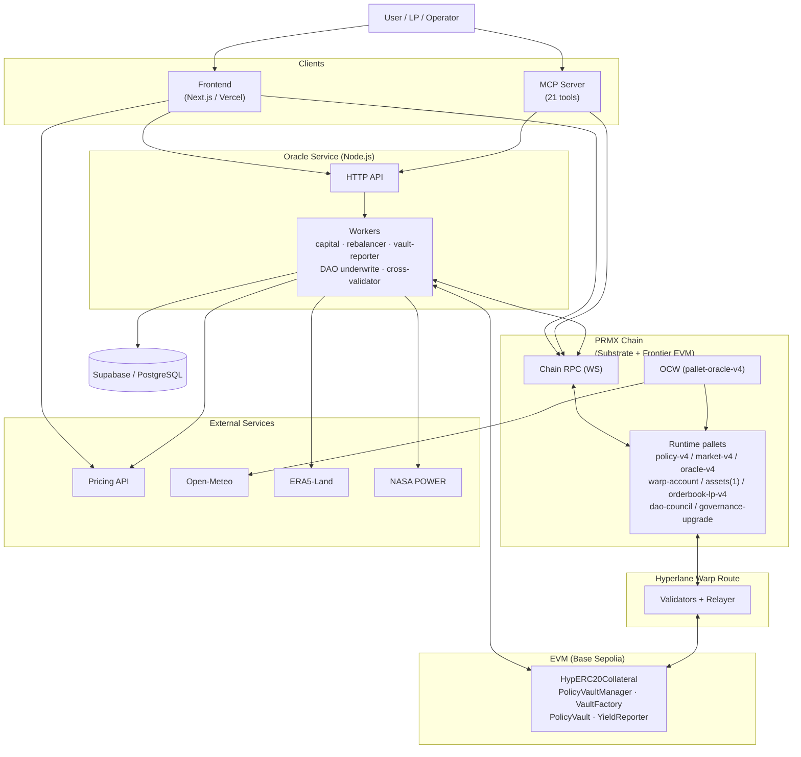
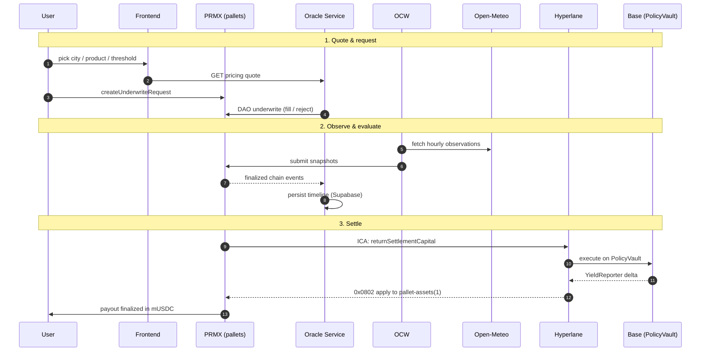

# PRMX V4 Architecture (Rainguard)

> **Scope**: End-to-end V4 system architecture — runtime, OCW, oracle service, pricing, frontend.

PRMX V4 is a Substrate-based parametric weather insurance system with a Rainguard-first UX and a multi-peril pricing catalog.

## At a glance

| Layer | Stack |
|---|---|
| Chain | Substrate runtime + Frontier EVM (PRMX) |
| Counterparty chain | Base Sepolia (per-entity vaults, yield strategies) |
| Cross-chain transport | Hyperlane Warp Route + ICA command bus |
| Settlement asset | mUSDC on PRMX (`pallet-assets(1)`), backed 1:1 by USDC on Base |
| Off-chain service | Node.js/TS oracle service (Supabase-backed) |
| Frontend | Next.js on Vercel |
| Pricing | Cloud Run API (ERA5 observed catalog) |
| Database | Supabase / PostgreSQL |

## Product surface

- **14 active products** across 3 lines: Rain Guard (3), Weather Gate (4), Climate Parametrics (7)
- **14 on-chain event types** (`PrecipSumGte` … `Pm25MaxGte`)
- **Active catalog source**: `GET /v4/catalog/info/live`
- **Spec source of truth**: `frontend/src/lib/product-specs.ts`

## Settlement model

Oracle evaluation and capital settlement are separate phases:

- A policy becoming `Triggered` or `Matured` is an **oracle outcome**, not a finalized payout.
- PRMX may hold the policy in a settlement-pending phase while local liquidity is prepared.
- UI and operator tooling must treat payout/LP distribution as final only after settlement finalization.

## Capital topology

| Surface | Role |
|---|---|
| PRMX chain | Settlement balance SSoT (`pallet-assets(1)` mUSDC), policy lifecycle, oracle |
| Base Sepolia | Per-entity policy vaults, yield strategies, settlement reserve |
| Hyperlane Warp Route | Token bridge — USDC ↔ mUSDC |
| Hyperlane ICA | PRMX → Base command bus (vault ops, rebalance) |
| Hyperlane yield-report | Base → PRMX vault state (`YieldReporter` → `0x0802`) |

### Per-Entity Vault Architecture

Each policy gets its own `PolicyVault` on Base, deployed by `VaultFactory`:

```
Hyperlane Warp Route (HypERC20Collateral on Base)
  └── PolicyVaultManager
        ├── VaultFactory (emits VaultDeployed)
        ├── PolicyVault[N] (one per policy)
        │     └── MorphoBlueStrategy (Base Sepolia testnet strategy)
        └── YieldReporter (Hyperlane vault reports → PRMX 0x0802)
```

| Phase | What happens |
|---|---|
| **Deposit** | User deposits USDC into `HypERC20Collateral`; Hyperlane mints mUSDC into `pallet-assets(1)` |
| **Vault creation** | Capital watcher detects `VaultFactory.VaultDeployed`; PRMX `record_vault_funded` confirms baseline |
| **Baseline calibration** | `record_vault_funded` / `correct_initial_vault_assets` mark calibrated; first yield report computes a real delta |
| **Auto-investment** | `PolicyVaultManager` allocates capital into `MorphoBlueStrategy` |
| **Yield reporting** | Base `YieldReporter` → Hyperlane → PRMX `YieldReportRecipient` → `0x0802` → reporter pallet |
| **Settlement liquidity** | `PolicyVaultManager.returnSettlementCapital(...)` via ICA before PRMX finalization |
| **UI freshness only** | Optional Base RPC NAV probe writes `policy_live_nav` (display only — never feeds accounting) |

Contract addresses: `evm/abi/deployments/shared-integration.chain-84532.offchain.env`

---

## System overview



---

## On-chain runtime

### Key modules

| Group | Pallet | Responsibility |
|---|---|---|
| **Policy lifecycle** | `prmxMarketV4` | Request creation, fills, status, cancel/expire |
| | `prmxPolicyV4` | Policy lifecycle, settlement, vault yield/loss accounting, DAO backstop |
| | `prmxOrderbookLpV4` | LP orderbook for policy LP tokens |
| **Oracle** | `prmxOracleV4` | Oracle state, snapshots, final reports |
| | `prmxMarkets` | Location registry (lat/lon for OCW) |
| **Capital / bridge** | `assets` (id `1`) | mUSDC settlement balance SSoT |
| | `warpAccount` | Bridge-backed liability, pending exits, exit finalization |
| | `pallet-prmx-policy-vault-reporter` | Hyperlane vault asset reports, rebalance acks |
| **Identity / holdings** | `prmxHoldings` | Holdings and LP balance tracking |
| | `prmxAccountLink` | PRMX ↔ EVM wallet link |
| **Governance / equity** | `daoCouncil` | `pallet-collective` instance, majority voting |
| | `governanceUpgrade` | Council-authorized runtime upgrades |
| | `prmxEquitySale` | Council-controlled PRMX sale rounds |
| | `prmxRevenueShare` | O(1) premium distribution accumulator |

### Event types and units

| Event type | Comparator | Unit | Duration |
|------------|------------|------|----------|
| `PrecipSumGte` | `>=` | `MmX1000` | 1 day |
| `Precip1hGte` | `>=` | `MmX1000` | 7 days |
| `Precip12hMaxGte` | `>=` | `MmX1000` | 7 days |
| `TempMaxGte` | `>=` | `CelsiusX1000` | 7 days |
| `TempMinLte` | `<=` | `CelsiusX1000` | 7 days |
| `WindGustMaxGte` | `>=` | `MpsX1000` | 7 days |
| `PrecipTypeOccurred` | bitmask overlap | `PrecipTypeMask` | 7 days |
| `HeatIndexMaxGte` | `>=` | `CelsiusX1000` | 7 days |
| `SnowDepthMaxGte` | `>=` | `CmX1000` | 7 days |
| `PressureDropMaxGte` | `>=` | `HpaX1000` | 7 days |
| `SunshineDurationSumLte` | `<=` | `HoursX1000` | 7 days |
| `RiverDischargeMaxGte` | `>=` | `M3psX1000` | 7 days |
| `WaveHeightMaxGte` | `>=` | `MX1000` | 7 days |
| `Pm25MaxGte` | `>=` | `UgM3X1000` | 7 days |

### Numeric conventions

- Settlement asset uses **6 decimals**. The target symbol is **mUSDC** (MockUSDC on testnets, backed 1:1 by USDC on EVM).
- Numeric thresholds use fixed-point scale `x1000` where applicable.
- Runtime `spec_version` changes with live testnet upgrades; query `state_getRuntimeVersion` for the active generation.

---

## Oracle architecture

### OCW responsibilities

1. Discover active policies.
2. Fetch hourly observations from Open-Meteo using location registry coordinates.
3. Parse normalized fields (precipitation, temperature, wind gust, weather code, and specialty fields).
4. Update on-chain oracle state / submit snapshots.

Constraint:
- Open-Meteo cadence is hourly, so first post-start observation aligns to the next hour boundary.

### OCW-to-service auth

- HMAC-authenticated ingest requests.
- Secret configured via `INGEST_HMAC_SECRET`.
- Provisioning helper: `scripts/set-oracle-secrets.mjs`.

---

## Offchain Oracle Service (Node.js/TS)

### Module structure

```text
oracle-service/src/
├── api/                  # REST endpoints (ingest, timeline, agent, DAO, admin)
├── capital/              # Hyperlane capital watcher, vault reporter, Morpho operators
├── chain/                # finalized block listener
├── dao-underwrite/       # request validation + acceptance + tracker (Supabase)
├── db/                   # Supabase access + timeline writes
├── rebalancer/           # monitor / decision / ICA executor
├── weather/              # Open-Meteo + cross-validation providers
├── constants/            # shared event constants
├── config.ts             # env parsing/validation (multi-route)
└── index.ts              # startup entrypoint
```

### Responsibilities

- Persist timeline events from finalized chain events.
- Run DAO auto-underwrite (validate premium, enforce whitelist/limits, accept requests).
- Expose policy timeline and operations endpoints.
- Execute ERA5 + NASA POWER cross-validation (audit only).
- Reconcile Hyperlane deposits/exits, PolicyVault creation/funding, reserve-return settlement, and finalization.
- Run rebalancer monitor/decision/executor. Rebalance-in is classified as `uncalibrated_or_unknown`, `already_funded`, or `real_drawdown_candidate`; only the drawdown class can become an automatic top-up decision.
- Report vault assets and rebalance acknowledgements through Hyperlane yield transport.
- Expose warp invariant status/history, Morpho testnet operator status, and display-only live NAV when the probe is enabled.

### API surface

| Group | Endpoints |
|---|---|
| **Ingest** (HMAC-auth) | `POST /ingest/ping` · `POST /ingest/observations/batch` · `POST /ingest/snapshots` · `GET /ingest/observations/:policyId` · `GET /ingest/snapshots/:policyId` · `GET /ingest/status/:policyId` · `GET /ingest/stats` |
| **Policy / timeline** | `GET /api/policies/:policyId/timeline` · `GET /api/policies/:policyId/timeline/summary` · `GET /api/policies/:policyId/snapshots/:snapshotId` · `POST /api/policies/:policyId/cross-validate` |
| **Agent** (MCP) | `GET /agent/markets[/:id]` · `GET /agent/portfolio/:address` · `GET /agent/lp/orderbook` · `GET /agent/lp/holdings/:address` · `GET /agent/climate/pricing` · `GET /agent/climate/catalog` · `GET /agent/locations` · `GET /agent/dao/status` · `GET /agent/requests/:address` · `POST /agent/tx/{buy-policy,buy-lp,place-lp-ask,cancel-lp-ask,cancel-request,expire-request,request-exit,submit}` |
| **DAO** | `GET /dao/status` · `GET /dao/records` |
| **Capital** | `GET /capital/invariants` · `GET /capital/warp-invariant[/history]` · `GET /capital/vault/status` · `GET /capital/morpho-borrower/status` · `GET /capital/yield-accrual/status` |
| **Health** | `GET /health` · `GET /admin/health` |

---

## Database (Supabase)

Supabase/PostgreSQL is the only backend database.

Schema: `oracle-service/supabase/schema.sql`

| Table | Purpose | TTL |
|-------|---------|-----|
| `chain_meta` | chain identity / restart detection | — |
| `observations` | raw hourly weather observations | 90 days |
| `snapshots` | aggregated policy snapshots | 90 days |
| `timeline_events` | UI audit/lifecycle timeline | 90 days |
| `dao_underwrite_records` | DAO request decision ledger | — |
| `policy_live_nav` | Display-only Base RPC PolicyVault NAV probe; never a settlement/accounting source | latest row per policy |

---

## Pricing architecture (Pricing API API)

Primary endpoint family:

- `POST /v4/pricing/quote` (peril-aware quote path)
- `GET /v4/catalog/info` (registry products)
- `GET /v4/catalog/info/live` (products with active catalog data)
- `GET /v4/catalog/regions` (region metadata)

### Product layering

- Catalog exposes 14 active perils (see `docs/product/V4-PRODUCT-CATALOG.md`).
- Frontend `/climate-parametrics` (Protection Terminal) wires all 14 purchasable perils.
- DAO default whitelist follows the active 14-product lineup (configurable by env).

### Frontend pricing proxy

- Frontend uses `/api/pricing` proxy.
- Proxy validates against the 14 active peril IDs and threshold buckets.
- Pricing auth uses API key and Cloud Run identity token flow.

---

## Frontend architecture (Next.js)

### Route structure

| Route | Purpose | Primary user |
|-------|---------|--------------|
| `/` | Landing page | All |
| `/products` | Product lineup hub (3 lines) | All |
| `/products/[line]` | Product line detail page | All |
| `/provide-liquidity` | LP onboarding landing | LP |
| `/manila` | Manila landing hub | Buyer |
| `/start`, `/start/[step]` | Onboarding flow | All |
| `/climate-peril-map` | Interactive climate hazard map | All |
| `/climate-parametrics` | **Protection Terminal** — unified purchase (14 products) | Buyer |
| `/policies` | Policy list (tabbed, searchable) | Buyer |
| `/policies/[id]` | Policy detail + timeline | Buyer |
| `/climate-parametrics/policy/[id]` | Climate Parametrics policy detail | Buyer |
| `/my-policies` | User's own policies (wallet-filtered) | Buyer |
| `/requests/new` | Request creation entry (redirect) | Buyer |
| `/requests/[id]` | Request detail/fill status | Buyer / LP |
| `/markets` | City/region market browser (40 cities) | Buyer |
| `/markets/[id]` | Market detail | Buyer |
| `/dashboard` | Platform overview | Buyer / Operator |
| `/lp` | LP portfolio/workflows | LP |
| `/equity` | Equity token (buy, vest, dividends) | LP / Operator |
| `/vault` | Vault dashboard (reporter, Hyperlane yield transport, discovered vaults) | Operator (DAO) |
| `/dao` | DAO operations and request processing | Operator (DAO) |
| `/oracle` | Oracle diagnostics | Operator (DAO) |
| `/oracle-service` | Oracle service status | Operator |
| `/agents` | AI Agent dashboard (portfolio, activity) | Operator (DAO) |
| `/admin` | Control Plane (health, capital, break-glass) | Operator (DAO) |
| `/settings` | Endpoint/environment settings | Operator |
| `/help` | Docs and FAQ | All |

Deployment style:
- Vercel CLI deployment from `frontend/`.

---

## End-to-end flow



### Settlement state machine

`PolicyTriggered` and `PolicyMatured` are **oracle outcomes**, not finalized payouts. UI and ops must distinguish:

1. Oracle outcome known (`Triggered` / `Matured`)
2. Base `PolicyVault → Reserve` return requested / pending / confirmed
3. PRMX settlement finalized in `pallet-assets(1)`
4. (Optional) user-initiated Base exit

Vault-backed settlement fails closed when `latestVaultAssets` is missing — the required-liquidity fallback is reserved for true no-vault policies so surplus Base principal cannot be silently orphaned. DAO backstop covers strategy shortfall to preserve the guaranteed cap on triggered payouts.

---

## MCP Server (AI Agent Interface)

Public MCP server at `https://mcp-server-six-ruby.vercel.app/mcp` (Streamable HTTP, stateless, no auth).

- **21 tools**: 12 read + 8 write + 1 utility
- **Architecture**: Client-side signing (B pattern) — server returns unsigned extrinsic hex, client signs with sr25519
- **Source**: `mcp-server/` directory, deployed to Vercel
- **Tool reference**: `mcp-server/TOOLS.md`

### Tool categories

| Category | Tools | Examples |
|----------|-------|---------|
| Market data | 6 | `get_markets`, `get_market_detail`, `get_policy_detail`, `get_portfolio` |
| LP/orderbook | 3 | `get_lp_orderbook`, `get_lp_holdings`, `get_unlisted_lp` |
| Climate/pricing | 3 | `get_climate_pricing`, `get_climate_catalog`, `get_locations` |
| Build transactions | 7 | `build_buy_policy`, `build_buy_lp`, `build_place_lp_ask`, `build_request_exit` |
| Submit | 1 | `submit_signed_tx` |
| Utility | 1 | `get_current_date` |

---

## Vault Yield System

Vault yield tracking ensures PRMX `pallet-assets(1)` accounting follows Base PolicyVault assets without confusing principal movement for yield:

- **Policy yield/loss**: Per-policy deltas are read from `PolicyVault.totalAssets()` and delivered through Hyperlane `YieldReporter` to PRMX `0x0802`. The runtime applies both credit and debit directions.
- **Capital movement separation**: Initial funding, rebalance credit/debit, and settlement reserve-return are treated as principal movement, not yield. The vault baseline is calibrated at funding time, the trusted yield-report transport is the only path that can mint upward yield, and rebalancer top-up eligibility is split into explicit classes.
- **Morpho mode**: Base Sepolia uses `MorphoBlueStrategy`. The borrower driver is testnet-only and off-book; it creates Morpho interest, but PRMX recognizes value only after vault reporting.
- **Live NAV probe**: optional UI freshness probe reads Base `PolicyVault.totalAssets()` every 30s and writes Supabase rows for display. It must not feed settlement, pricing, DAO underwriting, or backing invariants.
- **Triggered losses**: Negative strategy P/L does not reduce the guaranteed triggered payout cap. `prmxPolicyV4` uses DAO backstop accounting when the vault/pool is short.

---

## Key environment variables

| Variable | Required | Description |
|----------|----------|-------------|
| `SUPABASE_URL` | Yes | Supabase project URL |
| `SUPABASE_SERVICE_ROLE_KEY` | Yes | Supabase service key |
| `WS_URL` | Yes | Chain websocket endpoint |
| `INGEST_HMAC_SECRET` | Yes | OCW ingest auth secret |
| `REPORTER_MNEMONIC` | Yes | Oracle reporter account |
| `PRICING_API_URL` | Yes (DAO/pricing) | Pricing API base URL |
| `PRICING_API_KEY` | Usually | Pricing API key |
| `DAO_EVENT_TYPE_WHITELIST` | No | Comma-separated DAO event type allowlist |
| `DAO_LOCATION_WHITELIST` | No | Comma-separated location IDs |
| `API_PORT` | No | Oracle service HTTP port |
| `POLLING_INTERVAL_MS` | No | Listener polling interval |
| `INGEST_DEV_MODE` | No | Disable ingest auth checks (dev only) |
| `VAULT_REPORTER_TRANSPORT` | Usually | `hyperlane` (live) |
| `REBALANCER_MONITOR_ENABLED` / `REBALANCER_DECISION_ENABLED` / `REBALANCER_EXECUTOR_ENABLED` | Ops | Enables the three-stage rebalancer pipeline |
| `ICA_DISPATCH_ENABLED` | Ops | Enables PRMX → Base command dispatch through Hyperlane ICA |
| `MORPHO_BORROWER_DRIVER_ENABLED` | Testnet only | Enables the off-book borrower loop for observable Morpho yield |
| `MORPHO_LIVE_NAV_PROBE_ENABLED` | UI only | Enables display-only Base RPC NAV refresh into `policy_live_nav`; canonical accounting remains Hyperlane-delivered |
| `WARP_INVARIANT_MONITOR_ENABLED` | Ops | Persists and exposes `/capital/warp-invariant` samples |

---

## References

**Architecture**

- [Capital Invariants](/docs/architecture/CAPITAL-INVARIANTS) — SSoT rules and the three-tier backing model
- [Oracle Architecture](/docs/architecture/V4-ORACLE-ARCHITECTURE) — weather + capital + financial oracle roles
- [Parametric Insurance Rulebook](/docs/architecture/PARAMETRIC-INSURANCE-RULEBOOK) — peril taxonomy and settlement rules

**Product**

- [App Design](/docs/product/V4-APP-DESIGN) — UX flows and routes
- [Product Catalog](/docs/product/V4-PRODUCT-CATALOG) — 14 active products
- [Product Lineup](/docs/product/PRODUCT-LINEUP) — Rain Guard / Weather Gate / Climate Parametrics taxonomy
- [Rainguard Product Spec](/docs/product/RAINGUARD-PRODUCT-SPEC)
- [Open-Meteo Event Expansion](/docs/product/OPEN-METEO-EVENT-EXPANSION)

**Cross-chain transport**

- [m72 — pallet-assets canonical path](/docs/hyperlane-migration/m72-pallet-assets-hyperlane-canonical-path-decision)
- [m73 — Exit dispatcher](/docs/hyperlane-migration/m73-exit-dispatcher-design)
- [m75 — ICA & yield command bus](/docs/hyperlane-migration/m75-ica-yield-command-bus)
- [m76 — Yield-report transport](/docs/hyperlane-migration/m76-yield-report-hyperlane-transport)
- [m78 — PRMX EVM user actions](/docs/hyperlane-migration/m78-prmx-evm-user-actions-design)

**Guidelines**

- [UI Design Principles](/docs/guidelines/UI-DESIGN-PRINCIPLES)
- [Test Principles](/docs/guidelines/TEST-PRINCIPLE)
