# PRMX V4 Architecture (Rainguard)

> **Scope**: End-to-end V4 system architecture (runtime, OCW, oracle service, pricing, frontend).

PRMX V4 is a Substrate-based parametric weather insurance system with a Rainguard-first UX and a multi-peril pricing catalog.

Settlement model note:

- Oracle evaluation and capital settlement are now treated as separate phases.
- After a policy becomes `Triggered` or `Matured`, PRMX may keep it in a temporary settlement-pending phase while local liquidity is prepared from the capital layer.
- Frontend and operator tooling should treat payout or LP distribution as final only after settlement finalization, not merely after oracle finality.

Current product layers:

- **On-chain event types**: 14 (`PrecipSumGte` .. `Pm25MaxGte`; 3 removed from enum: UvIndexMaxGte, SoilMoistureMinLte, VisibilityMinLte)
- **Frontend purchasable products**: 14 (grouped by Rain Guard, Weather Gate, Climate Parametrics)
- **Active pricing catalog products**: 14 (from `/v4/catalog/info/live`; UV/Soil Moisture/Visibility removed from active catalog)
- **Product lines**: PRMX Rain Guard (3), PRMX Weather Gate (4), PRMX Climate Parametrics (7)
- **Product spec source of truth**: `frontend/src/lib/product-specs.ts`

## Capital topology

- `PRMX`: standalone Substrate chain on DigitalOcean (`wss://159-223-218-107.nip.io/ws`)
- `Counterparty chain`: Base Sepolia (sole EVM route — per-entity vaults, yield strategies)
- `Settlement asset`: `USDC` (MockUSDC on testnets), represented on PRMX as `pallet-assets(1)` mUSDC
- `Capital routing`: Hyperlane Warp Route + ICA command bus
- `Pallets`: `pallet-assets(1)` is the settlement-balance SSoT, `warpAccount` tracks bridge-backed liability / pending exits, `prmxPolicyV4` owns policy settlement and vault accounting, and `pallet-prmx-policy-vault-reporter` applies Hyperlane-delivered vault reports

### Per-Entity Vault Architecture

On Base Sepolia, each policy gets its own `PolicyVault` created by `VaultFactory`:

```
Hyperlane Warp Route (HypERC20Collateral on Base)
  └── PolicyVaultManager
        ├── VaultFactory (emits VaultDeployed)
        ├── PolicyVault[N] (one per policy)
        │     └── MorphoBlueStrategy (current Base Sepolia testnet strategy)
        └── YieldReporter (Hyperlane vault reports to PRMX 0x0802)
```

- **Deposit path**: User deposits USDC into Base `HypERC20Collateral`; Hyperlane delivery reaches PRMX and mints into `pallet-assets(1)`.
- **Vault creation**: Automated by the capital watcher after policy acceptance. Base `VaultFactory.VaultDeployed` is used as the early discovery surface, while PRMX `record_vault_funded` confirms the canonical non-zero baseline.
- **Vault baseline calibration**: `record_vault_funded` and `correct_initial_vault_assets` mark the vault baseline calibrated immediately. The first Hyperlane yield report must compute a real delta instead of being consumed as an implicit calibration cycle.
- **Auto-investment**: Policy capital is allocated through `PolicyVaultManager` and, on the current generation, invested into `MorphoBlueStrategy`.
- **Vault yield**: `vault-reporter` reads `PolicyVault.totalAssets`, separates principal/rebalance movement from yield, and reports through the trusted reporter-pallet path. The periodic route is Base `YieldReporter` -> Hyperlane -> PRMX `YieldReportRecipient` -> `0x0802` -> `pallet-prmx-policy-vault-reporter`.
- **Settlement liquidity**: Both triggered and no-event settlements can require `PolicyVaultManager.returnSettlementCapital(...)` via ICA before PRMX finalization.
- **Live NAV display**: `MORPHO_LIVE_NAV_PROBE_ENABLED` can populate `policy_live_nav` from Base RPC for UI freshness only. Settlement, pricing, DAO underwriting, backing, and mUSDC accounting continue to use Hyperlane-delivered PRMX state.
- **Addresses**: See `evm/abi/deployments/shared-integration.chain-84532.offchain.env`

---

## System overview

```mermaid
flowchart TB
  user[User / LP / Operator] --> fe[Frontend - Next.js on Vercel]
  fe <--> rpc[Chain RPC - WS]
  fe <--> osApi[Oracle Service API - HTTP]
  fe <--> pricingApi[Pricing API]

  subgraph Chain["PRMX Chain (Substrate runtime + Frontier EVM)"]
    ocw["OCW: pallet-oracle-v4"]
    pallets["Runtime pallets: market-v4 / policy-v4 / oracle-v4 / orderbook-lp-v4 / markets / holdings / account-link / warp-account / equity-sale / revenue-share / dao-council / governance-upgrade / assets"]
  end

  subgraph OracleSvc["Offchain Oracle Service (Node.js/TS)"]
    listener["Chain listener (finalized blocks)"]
    dao["DAO auto-underwrite"]
    crossval["Cross-validator (ERA5 + NASA POWER)"]
    capital["Capital watcher (deposit / exit / settlement / vault creation)"]
    rebalancer["Rebalancer monitor / decision / ICA executor"]
    vaultReporter["Vault reporter (Hyperlane yield transport)"]
    morphoOps["Morpho borrower / vault migration / live NAV probe"]
    dbLayer["DB layer (Supabase)"]
  end

  subgraph MCP["MCP Server (Vercel)"]
    mcpTools["21 tools: read / build_unsigned / submit_signed"]
  end

  subgraph DB["Database"]
    supa[(Supabase / PostgreSQL)]
  end

  subgraph External["External services"]
    om[Open-Meteo API]
    era5[ERA5-Land via Open-Meteo Historical]
    nasa[NASA POWER MERRA-2]
    ngcm[Pricing API]
  end

  ocw --> om
  dao --> ngcm
  crossval --> era5
  crossval --> nasa

  listener <--> rpc
  dao <--> rpc

  capital <--> evm
  rebalancer <--> evm
  vaultReporter <--> evm

  OracleSvc --> dbLayer
  dbLayer --> supa

  mcpTools <--> osApi
  mcpTools <--> rpc

  subgraph EVM["EVM Chains (Base Sepolia default)"]
    evm["HypERC20Collateral / PolicyVaultManager / VaultFactory / PolicyVault / YieldReporter"]
  end

  subgraph Bridge["Hyperlane"]
    relay["Hyperlane Warp Route (validators + relayer)"]
  end

  Chain <--> relay
  relay <--> evm
```



---

## On-chain runtime

### Key modules

- `prmxMarketV4`: request creation, fills, request status, cancel/expire requests
- `prmxPolicyV4`: policy lifecycle, settlement request, settlement finalization, vault yield (credit/debit)
- `prmxOracleV4`: oracle state, snapshots, final reports
- `prmxOrderbookLpV4`: LP orderbook/trading for policy LP tokens
- `prmxMarkets`: location registry (lat/lon source for OCW)
- `prmxHoldings`: holdings and LP balance tracking
- `prmxAccountLink`: PRMX account ↔ EVM wallet link intents and finalized mappings
- `warpAccount`: Hyperlane bridge-backed liability, pending exits, and canonical exit finalization
- `pallet-assets(1)`: canonical mUSDC settlement balance ledger
- `pallet-prmx-policy-vault-reporter`: Hyperlane vault asset reports and rebalance acknowledgements
- `prmxPolicyV4` (capital extensions): route-aware policy settlement, vault baseline, reserve-return, yield/loss, and DAO backstop accounting
- `prmxEquitySale`: council-controlled PRMX token sale rounds (USDC → PRMX exchange)
- `prmxRevenueShare`: O(1) accumulator for premium distribution to PRMX stakers
- `daoCouncil`: pallet-collective instance for governance (majority voting)
- `assets`: settlement asset accounting (asset id `1`, mUSDC)
- `governanceUpgrade`: council-authorized runtime upgrades (authorize hash → apply WASM)

### Event types and units

| Event type | Comparator | Unit | Duration |
|------------|------------|------|----------|
| `PrecipSumGte` | `>=` | `MmX1000` | 1 day |
| `Precip1hGte` | `>=` | `MmX1000` | 7 days |
| `Precip12hMaxGte` | `>=` | `MmX1000` | 7 days |
| `TempMaxGte` | `>=` | `CelsiusX1000` | 7 days |
| `TempMinLte` | `<=` | `CelsiusX1000` | 7 days |
| `WindGustMaxGte` | `>=` | `MpsX1000` | 7 days |
| `PrecipTypeOccurred` | bitmask overlap | `PrecipTypeMask` | 7 days |
| `HeatIndexMaxGte` | `>=` | `CelsiusX1000` | 7 days |
| `SnowDepthMaxGte` | `>=` | `CmX1000` | 7 days |
| `PressureDropMaxGte` | `>=` | `HpaX1000` | 7 days |
| `SunshineDurationSumLte` | `<=` | `HoursX1000` | 7 days |
| `RiverDischargeMaxGte` | `>=` | `M3psX1000` | 7 days |
| `WaveHeightMaxGte` | `>=` | `MX1000` | 7 days |
| `Pm25MaxGte` | `>=` | `UgM3X1000` | 7 days |

### Numeric conventions

- Settlement asset uses **6 decimals**. The target symbol is **mUSDC** (MockUSDC on testnets, backed 1:1 by USDC on EVM).
- Numeric thresholds use fixed-point scale `x1000` where applicable.
- Runtime `spec_version` changes with live testnet upgrades; query `state_getRuntimeVersion` for the active generation.

---

## Oracle architecture

### OCW responsibilities

1. Discover active policies.
2. Fetch hourly observations from Open-Meteo using location registry coordinates.
3. Parse normalized fields (precipitation, temperature, wind gust, weather code, and specialty fields).
4. Update on-chain oracle state / submit snapshots.

Constraint:
- Open-Meteo cadence is hourly, so first post-start observation aligns to the next hour boundary.

### OCW-to-service auth

- HMAC-authenticated ingest requests.
- Secret configured via `INGEST_HMAC_SECRET`.
- Provisioning helper: `scripts/set-oracle-secrets.mjs`.

---

## Offchain Oracle Service (Node.js/TS)

### Module structure

```text
oracle-service/src/
├── api/                  # REST endpoints (ingest, timeline, agent, DAO, admin)
├── capital/              # Hyperlane capital watcher, vault reporter, Morpho operators
├── chain/                # finalized block listener
├── dao-underwrite/       # request validation + acceptance + tracker (Supabase)
├── db/                   # Supabase access + timeline writes
├── rebalancer/           # monitor / decision / ICA executor
├── weather/              # Open-Meteo + cross-validation providers
├── constants/            # shared event constants
├── config.ts             # env parsing/validation (multi-route)
└── index.ts              # startup entrypoint
```

### Responsibilities

- Persist timeline events from finalized chain events.
- Run DAO auto-underwrite (validate premium, enforce whitelist/limits, accept requests).
- Expose policy timeline and operations endpoints.
- Execute ERA5 + NASA POWER cross-validation (audit only).
- Reconcile Hyperlane deposits/exits, PolicyVault creation/funding, reserve-return settlement, and finalization.
- Run rebalancer monitor/decision/executor. Rebalance-in is classified as `uncalibrated_or_unknown`, `already_funded`, or `real_drawdown_candidate`; only the drawdown class can become an automatic top-up decision.
- Report vault assets and rebalance acknowledgements through Hyperlane yield transport.
- Expose warp invariant status/history, Morpho testnet operator status, and display-only live NAV when the probe is enabled.

### API surface

Ingest endpoints:
- `POST /ingest/ping`
- `POST /ingest/observations/batch`
- `POST /ingest/snapshots`
- `GET /ingest/observations/:policyId`
- `GET /ingest/snapshots/:policyId`
- `GET /ingest/status/:policyId`
- `GET /ingest/stats`

Policy/timeline endpoints:
- `GET /api/policies/:policyId/timeline`
- `GET /api/policies/:policyId/timeline/summary`
- `GET /api/policies/:policyId/snapshots/:snapshotId`
- `POST /api/policies/:policyId/cross-validate`

Agent API endpoints (used by MCP server):
- `GET /agent/markets` / `GET /agent/markets/:id`
- `GET /agent/portfolio/:address`
- `GET /agent/lp/orderbook` / `GET /agent/lp/holdings/:address`
- `GET /agent/climate/pricing` / `GET /agent/climate/catalog`
- `GET /agent/locations`
- `GET /agent/dao/status`
- `GET /agent/requests/:address`
- `POST /agent/tx/buy-policy` / `buy-lp` / `place-lp-ask` / `cancel-lp-ask` / `cancel-request` / `expire-request` / `request-exit`
- `POST /agent/tx/submit`

DAO/admin endpoints:
- `GET /dao/status`
- `GET /dao/records`
- `GET /admin/health`
- `GET /capital/invariants`
- `GET /capital/warp-invariant`
- `GET /capital/warp-invariant/history`
- `GET /capital/vault/status`
- `GET /capital/morpho-borrower/status`
- `GET /capital/yield-accrual/status`
- `GET /health`

---

## Database (Supabase)

Supabase/PostgreSQL is the only backend database.

Schema: `oracle-service/supabase/schema.sql`

| Table | Purpose | TTL |
|-------|---------|-----|
| `chain_meta` | chain identity / restart detection | — |
| `observations` | raw hourly weather observations | 90 days |
| `snapshots` | aggregated policy snapshots | 90 days |
| `timeline_events` | UI audit/lifecycle timeline | 90 days |
| `dao_underwrite_records` | DAO request decision ledger | — |
| `policy_live_nav` | Display-only Base RPC PolicyVault NAV probe; never a settlement/accounting source | latest row per policy |

---

## Pricing architecture (Pricing API API)

Primary endpoint family:

- `POST /v4/pricing/quote` (peril-aware quote path)
- `GET /v4/catalog/info` (registry products)
- `GET /v4/catalog/info/live` (products with active catalog data)
- `GET /v4/catalog/regions` (region metadata)

### Product layering

- Catalog exposes 14 active perils (see `docs/product/V4-PRODUCT-CATALOG.md`).
- Frontend `/climate-parametrics` (Protection Terminal) wires all 14 purchasable perils.
- DAO default whitelist follows the active 14-product lineup (configurable by env).

### Frontend pricing proxy

- Frontend uses `/api/pricing` proxy.
- Proxy validates against the 14 active peril IDs and threshold buckets.
- Pricing auth uses API key and Cloud Run identity token flow.

---

## Frontend architecture (Next.js)

### Route structure

| Route | Purpose | Primary user |
|-------|---------|--------------|
| `/` | Landing page | All |
| `/products` | Product lineup hub (3 lines) | All |
| `/products/[line]` | Product line detail page | All |
| `/provide-liquidity` | LP onboarding landing | LP |
| `/manila` | Manila landing hub | Buyer |
| `/start`, `/start/[step]` | Onboarding flow | All |
| `/climate-peril-map` | Interactive climate hazard map | All |
| `/climate-parametrics` | **Protection Terminal** — unified purchase (14 products) | Buyer |
| `/policies` | Policy list (tabbed, searchable) | Buyer |
| `/policies/[id]` | Policy detail + timeline | Buyer |
| `/climate-parametrics/policy/[id]` | Climate Parametrics policy detail | Buyer |
| `/my-policies` | User's own policies (wallet-filtered) | Buyer |
| `/requests/new` | Request creation entry (redirect) | Buyer |
| `/requests/[id]` | Request detail/fill status | Buyer / LP |
| `/markets` | City/region market browser (40 cities) | Buyer |
| `/markets/[id]` | Market detail | Buyer |
| `/dashboard` | Platform overview | Buyer / Operator |
| `/lp` | LP portfolio/workflows | LP |
| `/equity` | Equity token (buy, vest, dividends) | LP / Operator |
| `/vault` | Vault dashboard (reporter, Hyperlane yield transport, discovered vaults) | Operator (DAO) |
| `/dao` | DAO operations and request processing | Operator (DAO) |
| `/oracle` | Oracle diagnostics | Operator (DAO) |
| `/oracle-service` | Oracle service status | Operator |
| `/agents` | AI Agent dashboard (portfolio, activity) | Operator (DAO) |
| `/admin` | Control Plane (health, capital, break-glass) | Operator (DAO) |
| `/settings` | Endpoint/environment settings | Operator |
| `/help` | Docs and FAQ | All |

Deployment style:
- Vercel CLI deployment from `frontend/`.

---

## End-to-end flow summary

### 1) Quote and create request

1. User selects city/product/threshold/coverage.
2. Frontend requests premium from pricing API (via proxy).
3. User submits `createUnderwriteRequest` on-chain.
4. DAO listener validates and fills/rejects request.
5. DAO records and timeline events persist to Supabase.

### 2) Observe and evaluate

1. OCW polls active policies.
2. OCW fetches Open-Meteo hourly data.
3. OCW updates oracle state / submits snapshots.
4. Oracle service writes timeline events from finalized chain events.

### 3) Settle

- `PolicyTriggered`: PRMX payout to holder, with DAO backstop covering strategy shortfall when needed to preserve the guaranteed cap.
- `PolicyTriggered` or `PolicyMatured` should be read as finalized settlement outcomes, not merely oracle outcomes.
- Before finalization, the system may expose an intermediate settlement-pending/liquidity-preparing state in UI and ops surfaces.
- Vault-backed settlement finalization fails closed when `latestVaultAssets` is missing. The required-liquidity fallback is reserved for true no-vault policies so surplus Base principal cannot be silently orphaned.
- Service and UI should distinguish:
  - oracle outcome known
  - Base `PolicyVault -> Reserve` return requested / pending / confirmed
  - PRMX settlement finalized in `pallet-assets(1)`
  - later user-initiated Base exit, if the user chooses one

---

## MCP Server (AI Agent Interface)

Public MCP server at `https://mcp-server-six-ruby.vercel.app/mcp` (Streamable HTTP, stateless, no auth).

- **21 tools**: 12 read + 8 write + 1 utility
- **Architecture**: Client-side signing (B pattern) — server returns unsigned extrinsic hex, client signs with sr25519
- **Source**: `mcp-server/` directory, deployed to Vercel
- **Tool reference**: `mcp-server/TOOLS.md`

### Tool categories

| Category | Tools | Examples |
|----------|-------|---------|
| Market data | 6 | `get_markets`, `get_market_detail`, `get_policy_detail`, `get_portfolio` |
| LP/orderbook | 3 | `get_lp_orderbook`, `get_lp_holdings`, `get_unlisted_lp` |
| Climate/pricing | 3 | `get_climate_pricing`, `get_climate_catalog`, `get_locations` |
| Build transactions | 7 | `build_buy_policy`, `build_buy_lp`, `build_place_lp_ask`, `build_request_exit` |
| Submit | 1 | `submit_signed_tx` |
| Utility | 1 | `get_current_date` |

---

## Vault Yield System

Vault yield tracking ensures PRMX `pallet-assets(1)` accounting follows Base PolicyVault assets without confusing principal movement for yield:

- **Policy yield/loss**: Per-policy deltas are read from `PolicyVault.totalAssets()` and delivered through Hyperlane `YieldReporter` to PRMX `0x0802`. The runtime applies both credit and debit directions.
- **Capital movement separation**: Initial funding, rebalance credit/debit, and settlement reserve-return are treated as principal movement, not yield. The vault baseline is calibrated at funding time, the trusted yield-report transport is the only path that can mint upward yield, and rebalancer top-up eligibility is split into explicit classes.
- **Morpho mode**: Base Sepolia uses `MorphoBlueStrategy`. The borrower driver is testnet-only and off-book; it creates Morpho interest, but PRMX recognizes value only after vault reporting.
- **Live NAV probe**: optional UI freshness probe reads Base `PolicyVault.totalAssets()` every 30s and writes Supabase rows for display. It must not feed settlement, pricing, DAO underwriting, or backing invariants.
- **Triggered losses**: Negative strategy P/L does not reduce the guaranteed triggered payout cap. `prmxPolicyV4` uses DAO backstop accounting when the vault/pool is short.

---

## Key environment variables

| Variable | Required | Description |
|----------|----------|-------------|
| `SUPABASE_URL` | Yes | Supabase project URL |
| `SUPABASE_SERVICE_ROLE_KEY` | Yes | Supabase service key |
| `WS_URL` | Yes | Chain websocket endpoint |
| `INGEST_HMAC_SECRET` | Yes | OCW ingest auth secret |
| `REPORTER_MNEMONIC` | Yes | Oracle reporter account |
| `PRICING_API_URL` | Yes (DAO/pricing) | Pricing API base URL |
| `PRICING_API_KEY` | Usually | Pricing API key |
| `DAO_EVENT_TYPE_WHITELIST` | No | Comma-separated DAO event type allowlist |
| `DAO_LOCATION_WHITELIST` | No | Comma-separated location IDs |
| `API_PORT` | No | Oracle service HTTP port |
| `POLLING_INTERVAL_MS` | No | Listener polling interval |
| `INGEST_DEV_MODE` | No | Disable ingest auth checks (dev only) |
| `VAULT_REPORTER_TRANSPORT` | Usually | `hyperlane` (live) |
| `REBALANCER_MONITOR_ENABLED` / `REBALANCER_DECISION_ENABLED` / `REBALANCER_EXECUTOR_ENABLED` | Ops | Enables the three-stage rebalancer pipeline |
| `ICA_DISPATCH_ENABLED` | Ops | Enables PRMX → Base command dispatch through Hyperlane ICA |
| `MORPHO_BORROWER_DRIVER_ENABLED` | Testnet only | Enables the off-book borrower loop for observable Morpho yield |
| `MORPHO_LIVE_NAV_PROBE_ENABLED` | UI only | Enables display-only Base RPC NAV refresh into `policy_live_nav`; canonical accounting remains Hyperlane-delivered |
| `WARP_INVARIANT_MONITOR_ENABLED` | Ops | Persists and exposes `/capital/warp-invariant` samples |

---

## References

### Current architecture set
- Capital invariants & SSoT rules: `docs/architecture/CAPITAL-INVARIANTS.md`
- Oracle architecture: `docs/architecture/V4-ORACLE-ARCHITECTURE.md`
- Parametric rules: `docs/architecture/PARAMETRIC-INSURANCE-RULEBOOK.md`
- DeFi operational patterns: `docs/architecture/DEFI-OPERATIONAL-PATTERNS.md`

### Product
- App design: `docs/product/V4-APP-DESIGN.md`
- V4 product catalog (14 active products): `docs/product/V4-PRODUCT-CATALOG.md`
- Product lineup taxonomy: `docs/product/PRODUCT-LINEUP.md`
- Rain Guard rainfall spec: `docs/product/RAINGUARD-PRODUCT-SPEC.md`
- Event expansion roadmap: `docs/product/OPEN-METEO-EVENT-EXPANSION.md`

### Cross-chain transport
- `pallet-assets(1)` canonical path: [m72](/docs/hyperlane-migration/m72-pallet-assets-hyperlane-canonical-path-decision)
- Exit dispatcher: [m73](/docs/hyperlane-migration/m73-exit-dispatcher-design)
- ICA + yield command bus: [m75](/docs/hyperlane-migration/m75-ica-yield-command-bus)
- Hyperlane yield-report transport: [m76](/docs/hyperlane-migration/m76-yield-report-hyperlane-transport)
- PRMX EVM user-actions surface: [m78](/docs/hyperlane-migration/m78-prmx-evm-user-actions-design)

### Guidelines
- UI design principles: [UI Design Principles](/docs/guidelines/UI-DESIGN-PRINCIPLES)
- Test principles: [Test Principles](/docs/guidelines/TEST-PRINCIPLE)
