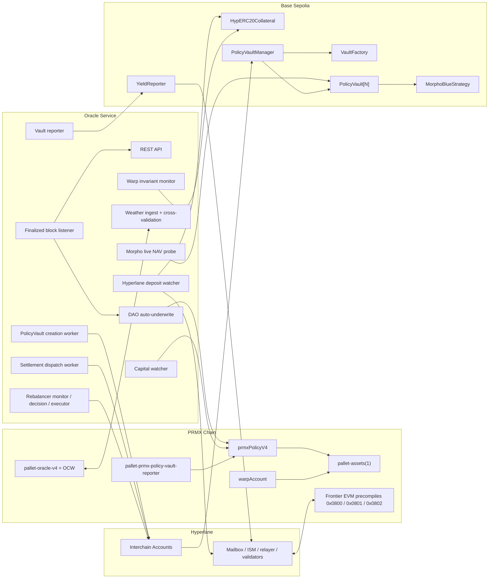

# PRMX V4 Oracle Architecture

> **Scope**: Oracle responsibilities in PRMX V4, including Hyperlane cross-chain operations.

## Three meanings of "oracle"

| Sense | Where it lives | Role |
|---|---|---|
| **Weather oracle** | `pallet-oracle-v4` + OCW (in the PRMX node) | Observe weather, build snapshots, determine if a parametric event occurred |
| **Oracle service** | `oracle-service/` (Node.js/TS) | Persist timelines, run DAO underwrite, expose APIs, coordinate capital ops |
| **Capital automation** | Selected `oracle-service` modules | Move cross-chain workflows forward — never become the settlement ledger |

The settlement ledger is always PRMX runtime storage + Hyperlane-delivered contract effects.

## Design rules

- **`pallet-assets(1)` is the mUSDC SSoT.** All settlement balances live here.
- **Oracle finality ≠ capital settlement finality.** A `Triggered` or `Matured` policy is fully settled only after PRMX applies the distribution in `pallet-assets(1)`.
- **Deposits/exits use canonical Hyperlane routes.** No oracle-attested shortcut may mint mUSDC.
- **ICA is a command bus, not a transport.** It carries vault creation, rebalance, reserve return, and yield commands — not deposits or exits.
- **Yield is recognized only via the yield-report transport.** Base vault state must reach PRMX through `YieldReporter` → `0x0802`.
- **Principal ≠ yield.** Funding, rebalances, and reserve returns are separated from policy yield/loss accounting.
- **Fail closed.** Missing delivery, stale freshness, or missing ICA wire-up halts the affected workflow.

## System Context



## Component Responsibilities

| Component | Owns | Does not own |
| --- | --- | --- |
| `pallet-oracle-v4` OCW | Weather observation, snapshot submission, oracle state | Base liquidity, vault operations, Hyperlane relaying |
| Oracle service API | Timeline, readback, operator endpoints, health | Client custody, public user signing |
| DAO auto-underwrite | Request validation and acceptance according to DAO limits | Weather event finality, settlement liquidity |
| Capital watcher | Polls PRMX queues and advances cross-chain capital state machines | Ledger authority or bypass mints |
| Hyperlane deposit watcher | Deposit lifecycle observability keyed by Hyperlane `messageId` | Minting mUSDC directly |
| Policy vault creation worker | Ensures Base vault deployment, funding, and PRMX vault record | Yield/loss recognition after the baseline |
| Settlement dispatch worker | Returns policy settlement capital to reserve and finalizes PRMX settlement | Direct Base wallet payouts |
| Vault reporter | Reads Base `PolicyVault.totalAssets()` and reports assets/rebalance acks to PRMX | Treating funding/rebalance as yield |
| Morpho live NAV probe | Display-only Base RPC `PolicyVault.totalAssets()` readback for UI freshness between canonical reports | Settlement, pricing, DAO underwriting, or mUSDC backing decisions |
| Rebalancer monitor/decision/executor | Detects drift, builds decisions, dispatches allowed ICA commands | Oracle weather decisions or settlement finality |
| Warp invariant monitor | Observes Hyperlane backing parity and persists alert samples | Halting deposits or changing balances |

## Weather Oracle Role

The weather oracle answers one narrow product question: did the policy's
parametric condition occur during the coverage window?

This responsibility belongs to the PRMX node's `pallet-oracle-v4` OCW. If the
PRMX node is hosted on the same DigitalOcean machine as the Node.js
`oracle-service`, that is only deployment colocation. The authority boundary is
still:

- `pallet-oracle-v4` OCW: fetches Open-Meteo observations, builds snapshots, and
  advances oracle state.
- `oracle-service`: stores ingest/timeline data, follows finalized events, runs
  DAO automation, exposes APIs, and coordinates capital workflows.

### Inputs

- Active V4 policies and their event specs.
- Location coordinates from the on-chain location registry.
- Open-Meteo hourly weather observations.
- Optional audit sources from the oracle service cross-validator:
  ERA5-Land through Open-Meteo Historical and NASA POWER MERRA-2.

### Outputs

- On-chain oracle state and snapshots.
- Final oracle reports that move a policy toward `Triggered` or `Matured`.
- Supabase observation, snapshot, and timeline rows for UI and audit.

Cross-validation is an audit surface. It can support review and dashboards, but
the production settlement path must follow the runtime's accepted oracle state.

## Oracle Service Runtime Model

The service runs in one of two modes:

| Mode | Use | Notes |
| --- | --- | --- |
| `MODE=monolith` | Default live path | One API process owns API, listeners, capital automation, reporter, rebalancer, and monitors. |
| `MODE=workers` | Split worker path | Independent deposit, exit, settlement, and yield-reporter processes use Supabase leader election. |

Core boot sequence in monolith mode:

1. Connect to Supabase.
2. Connect to the PRMX websocket.
3. Subscribe to finalized chain events.
4. Start the REST API and metrics server.
5. Start enabled capital, Hyperlane, vault, rebalancer, Morpho borrower,
   Morpho live-NAV, invariant, and publisher modules.

Modules stay dormant when required env is missing. In live operations this is a
safety property: incomplete ICA or Hyperlane config should not silently fall
back to a weaker path.

## Cross-Chain Operating Model

### 1. Canonical Deposit Observation

The canonical inbound route is:

```text
Base HypERC20Collateral lock
-> Hyperlane Mailbox / ISM / relayer / validators
-> PRMX SettlementBridgeRecipient
-> SettlementAssetERC20
-> 0x0800 pallet-assets precompile
-> pallet-assets(1)::mint
```

The oracle service observes this path rather than replacing it.

- `hyperlane-deposit-watcher` reads Base source logs and PRMX destination logs.
- It keys `hyperlane_deposits` rows by Hyperlane `messageId`.
- Source observations come from Base `SentTransferRemote` plus Mailbox
  `DispatchId`.
- Destination observations come from PRMX settlement-mint events plus Mailbox
  `ProcessId`.
- Upserts are idempotent and tolerate out-of-order source/destination delivery.
- `hyperlane_watcher_cursors` store per-chain scan progress.
- `hyperlane-deposit-attest-worker` must remain observe-only on live
  zero-start generations. It must not mint via `warpAccount.attestDeposit`.

Deposit health is proven by the PRMX mint into `pallet-assets(1)`, not by an
oracle-service database row alone.

### 2. Policy Vault Creation and Initial Funding

After a policy is accepted, the capital layer must create and fund a per-policy
Base vault.

```text
PRMX policy state
-> oracle-service policy-vault-creation worker
-> PRMX ICA dispatch
-> Base IcaReceiver
-> IcaCommandRouter
-> VaultFactory / PolicyVaultManager
-> PolicyVault
-> PRMX record_vault_funded
```

The worker:

- scans `prmxPolicyV4.policies`;
- reads `policyPoolBalance(policyId)` as the PRMX authoritative funding amount;
- checks Base `VaultFactory.deployedVault(policyId)` and
  `PolicyVaultManager.policyVault(policyId)`;
- deploys a vault when a funded policy has no Base vault;
- verifies the vault is allowlisted as a bridge on `HypERC20Collateral`;
- rebalances initial capital from the Hyperlane collateral reserve into the
  policy vault;
- reads `PolicyVault.totalAssets()`;
- records the PRMX vault baseline through `record_vault_funded`.

This establishes the non-zero vault baseline. Later vault total changes are
reported by the vault reporter, not by the creation worker.

### 3. ICA Command Bus

ICA is the controlled PRMX-to-Base command path:

```text
PRMX EVM InterchainAccountRouter
-> Hyperlane Mailbox / ISM / relayer / validators
-> Base InterchainAccountRouter
-> deterministic Base ICA proxy
-> IcaReceiver.execute(bytes)
-> IcaCommandRouter.execute(target, calldata)
-> allowlisted Base target
```

Allowed command families include:

- `VaultFactory.deployVault(bytes32)`;
- `PolicyVaultManager.rebalance(bytes32[],int256[])`;
- `PolicyVaultManager.returnSettlementCapital(bytes32,uint256)`;
- testnet yield commands such as strategy accrual;
- future explicitly allowlisted reserve/yield operations.

Base contracts that use `onlyOperator` are wired to `IcaCommandRouter`, not a direct operator EOA. Direct Base writes are reserved for local/dev only; if ICA is enabled but incomplete, live modules stay dormant.

### 4. Vault Yield Report Transport

The live yield report path is Hyperlane-native:

```text
oracle-service VaultReporter
-> Base YieldReporter.dispatchYieldBatch / dispatchYieldSingle / dispatchRebalanceAck
-> Base Mailbox
-> Hyperlane delivery
-> PRMX YieldReportRecipient
-> 0x0802 yield-report precompile
-> pallet-prmx-policy-vault-reporter
-> prmxPolicyV4 VaultAssetsReportHook
-> pallet-assets(1)
```

The vault reporter:

- discovers policy vaults from PRMX policy state and Base vault events;
- reads `PolicyVault.totalAssets()`;
- sends periodic batch reports and targeted single-policy refreshes;
- sends rebalance acknowledgements from Base `PolicyVaultManager` events;
- uses `VAULT_REPORTER_TRANSPORT=hyperlane` on the current live generation;
- treats `both` as rollback or next-generation soak mode after redeploys.

Pre-settlement refreshes must wait until PRMX `reported_at` is strictly newer
than the pending settlement's freshness block. Timeout means fail closed: leave
the pending settlement in place for retry instead of finalizing against stale
vault data.

### 4a. Morpho Share Accounting

For Morpho-backed policies, yield is still observed per policy. The important
detail is that Morpho Blue and PRMX use two different share layers:

1. Morpho Blue tracks one supplier position for the `MorphoBlueStrategy`
   contract.
2. `MorphoBlueStrategy` tracks policy-vault ownership internally with
   `shares[policyVault]` and `totalShares`.

The Base-side read path is:

```text
PolicyVault.totalAssets()
-> idle USDC held by that PolicyVault
 + MorphoBlueStrategy.assetsOf(policyVault)
-> strategy internal shares[policyVault] / totalShares
-> strategy managed assets
-> idle USDC in strategy
 + Morpho position supplyShares * market.totalSupplyAssets / market.totalSupplyShares
```

Consequences:

- The vault reporter does not read a global Morpho market value and assign it
  directly to PRMX. It reads each policy's `PolicyVault.totalAssets()`.
- Morpho's `supplyShares` belong to the strategy contract. Policy-level
  attribution comes from `MorphoBlueStrategy.shares[policyVault]`.
- `PolicyVault.totalAssets()` has no arguments. The policy identity comes from
  the vault address selected for that `policyId`.
- `PolicyVault.totalAssets()` is a view read. It does not itself call
  `Morpho.accrueInterest`. In Morpho mode, the yield-accrual driver or operator
  endpoint calls `MorphoBlueStrategy.accrue()` to refresh the market; borrower
  activity creates the economic interest, but PRMX books value only after the
  later vault report lands.
- When the report reaches PRMX, it carries `(policyId, totalAssets)`. The
  runtime compares that total against the policy's previous
  `latestVaultAssets`, adjusted for pending rebalance credit/debit, and only the
  remaining delta becomes yield or loss.

This is the core reason Morpho-backed yield remains policy-scoped even though
Morpho itself uses a market-wide share system.

### 4b. Display-Only Morpho Live NAV Probe

The canonical per-policy NAV remains the Hyperlane-delivered vault report. The
Morpho live NAV probe exists only because Morpho interest can accrue every Base
block while the canonical report cadence is much slower.

- `morpho-live-nav-probe` reads each policy vault's `PolicyVault.totalAssets()`
  directly from Base RPC every `MORPHO_LIVE_NAV_PROBE_INTERVAL_MS`.
- It persists `policy_live_nav` rows with source `base_rpc_probe`.
- The API exposes `GET /capital/morpho-live-nav-probe/status` and
  `GET /capital/policies/:policyId/live-nav`.
- Frontend policy detail may compare this display value against canonical
  `latestVaultAssets`, but settlement, pricing, DAO underwriting, and backing
  invariants must never read `policy_live_nav`.
- Probe failures degrade the live display only; they do not block or mutate any
  on-chain flow.

### 5. Settlement Reserve Return and Finalization

Weather finality does not directly pay a user. After a policy becomes
`Triggered` or `Matured`, settlement may need Base reserve-return work before
PRMX finalization.

```text
PRMX pending settlement
-> oracle-service settlement dispatch worker
-> ICA PolicyVaultManager.returnSettlementCapital(policyId, amount)
-> Base PolicyVault -> shared reserve
-> Base SettlementCapitalReturned evidence
-> PRMX finalize settlement with Base tx hash replay guard
-> pallet-assets(1) payout or LP/protocol distribution
```

Rules:

- Triggered and no-event/matured policies can both require reserve return.
- For vault-backed policies, the returned amount is the fresh
  `latestVaultAssets` snapshot for that policy vault. This drains policy-scoped
  surplus principal/yield back to the shared reserve before the policy is
  closed on PRMX.
- If `latestVaultAssets` is missing for a vault-backed settlement, the worker
  fails closed and waits for a fresh pre-settlement vault report. The
  `requiredLocalLiquidity` fallback is reserved for true no-vault policies.
- PRMX liquidity acknowledgement is clamped to outstanding pending local
  liquidity, so a larger Base reserve return does not become a fresh mint.
- Base `PolicyVault -> Reserve` is not a user payout.
- Users receive PRMX settlement accounting first. They can later exit to Base
  through the normal `warpAccount.request_exit` route.
- The settlement worker never pays the holder's Base wallet directly and never
  mints mUSDC.

### 6. User Exits

Exits are user-initiated and separate from settlement reserve return:

```text
warpAccount.request_exit
-> escrow / burn against pallet-assets(1)
-> PRMX EVM dispatch surface
-> Hyperlane delivery
-> Base collateral release
-> PRMX finalize_exit
```

The oracle service may help dispatch, observe, and finalize exit lifecycle
state, but the spendable balance source is still `pallet-assets(1)` and the
release path is the canonical Hyperlane outbound route.

### 7. Rebalancer

The rebalancer is a three-stage operational automation:

| Stage | Role |
| --- | --- |
| Monitor | Reads Base collateral, vault state, reserve floor, and drift signals. |
| Decision | Builds signed rebalance intents without submitting transactions. |
| Executor | Submits decisions through ICA when configured, with circuit breaker protection. |

Rebalance effects are principal movement. They become PRMX-visible through
rebalance acknowledgements and vault reports, not through synthetic yield.

The monitor emits a three-way rebalance-in class:

- `uncalibrated_or_unknown`: no target or no recorded baseline; wait and expose
  the condition.
- `already_funded`: PRMX initial/latest evidence shows the vault was already
  funded at or above target; do not auto top-up a later EVM-only shortfall.
- `real_drawdown_candidate`: latest PRMX snapshot is below target by more than
  tolerance; this is the only class eligible for automatic rebalance-in.

`REBALANCER_MONITOR_FUNDING_BASELINE_TOLERANCE_ATOMIC` defaults to 1 USDC
(`1000000` atoms) to absorb rounding/report timing without hiding material
funding gaps.

### 8. Morpho Testnet Operations

The current Base Sepolia testnet strategy is `MorphoBlueStrategy`.

- The Morpho borrower driver is testnet-only and off-book.
- It creates market utilization so real borrow interest can accrue.
- PRMX does not book yield from the borrower driver itself.
- PRMX recognizes Morpho value only after `PolicyVault.totalAssets()` is
  reported through the vault-report path.
- Vault migration is an explicit operator window, not a background default.

## Data and API Surfaces

Supabase/PostgreSQL stores operational read models:

| Table family | Purpose |
| --- | --- |
| observations / snapshots | Weather observation and oracle audit history |
| timeline_events | UI lifecycle timeline |
| dao_underwrite_records | DAO acceptance/rejection ledger |
| hyperlane_deposits | Deposit message lifecycle keyed by Hyperlane `messageId` |
| hyperlane_watcher_cursors | Resume points for cross-chain log scans |
| policy_live_nav | Display-only Morpho live NAV observations from Base RPC |
| worker_leadership | Split-worker leader election |
| warp_invariant_samples | Bridge-net parity monitoring |

Important API/readback surfaces:

- `/ingest/*`: HMAC-authenticated OCW ingest.
- `/api/policies/:policyId/timeline`: user and operator timeline.
- `/dao/status`, `/dao/records`: DAO auto-underwrite status.
- `/capital/invariants?routeId=2`: route-level capital invariant snapshot.
- `/capital/warp-invariant`: Hyperlane bridge-net parity readback.
- `/capital/vault/status`: vault reporter and policy vault status.
- `/capital/yield-accrual/status`: testnet yield command status.
- `/capital/morpho-borrower/status`: testnet Morpho utilization driver status.
- `/capital/morpho-live-nav-probe/status`: display-only Morpho NAV probe status.
- `/capital/policies/:policyId/live-nav`: latest display-only live NAV row.
- `/capital/operator/*`: token-protected operator trigger endpoints.

Operator mutation endpoints require `Authorization: Bearer
$CAPITAL_OPERATOR_TOKEN`.

## Failure Handling and Idempotency

The oracle service is deliberately retry-oriented:

- Hyperlane deposits are idempotent by `messageId`.
- Log scanners persist cursors and can resume after restart.
- Out-of-order source and destination delivery is valid.
- PRMX settlement finalization records Base tx hashes as replay guards.
- Policy vault creation re-reads both chains before acting.
- ICA commands wait for Base effects instead of assuming dispatch success.
- Vault reporting quarantines or suppresses unsafe entries instead of minting
  false yield.
- Zero-baseline reports are suppressed until matching funding or rebalance
  acknowledgement evidence exists.
- Vault-backed settlement fails closed when the latest vault-asset snapshot is
  missing, instead of finalizing against stale or incomplete Base evidence.
- Rebalancer executor uses a circuit breaker on repeated submission failures.
- Missing required env makes modules dormant rather than partially active.

## Security and Authority Boundaries

The oracle service is privileged operational infrastructure, but its authority
is intentionally bounded.

It may:

- submit configured oracle, DAO, capital, vault-report, and operator extrinsics;
- dispatch allowlisted ICA commands;
- expose operator endpoints guarded by `CAPITAL_OPERATOR_TOKEN`;
- write Supabase operational read models;
- publish metrics and health state.

It must not:

- create mUSDC outside the canonical Hyperlane inbound route;
- bypass `pallet-assets(1)` as the ledger;
- treat the PRMX EVM synthetic token as a separate user-balance system;
- pay user Base wallets during settlement;
- mark settlement complete from oracle outcome alone;
- book yield from initial funding, rebalance, reserve-return, or borrower-driver
  activity;
- use direct Base operator writes as the live path;
- hide invariant drift by minting or suppressing losses.

## Key Environment Groups

| Group | Representative variables |
| --- | --- |
| Core | `WS_URL`, `SUPABASE_URL`, `SUPABASE_SERVICE_ROLE_KEY`, `INGEST_HMAC_SECRET` |
| DAO/pricing | `PRICING_API_URL`, `PRICING_API_KEY`, `DAO_EVENT_TYPE_WHITELIST`, `DAO_LOCATION_WHITELIST` |
| Hyperlane deposits | `HYPERLANE_*`, `HYPERLANE_DEPOSIT_ATTEST_MODE=observe` |
| Vault reporter | `VAULT_REPORTER_ENABLED`, `VAULT_REPORTER_TRANSPORT=hyperlane`, `VAULT_REPORTER_YIELD_REPORTER_ADDRESS` |
| ICA | `ICA_DISPATCH_ENABLED`, `PRMX_ICA_*`, `BASE_ICA_*`, `ICA_DISPATCH_GAS_LIMIT` |
| Rebalancer | `REBALANCER_MONITOR_ENABLED`, `REBALANCER_DECISION_ENABLED`, `REBALANCER_EXECUTOR_ENABLED`, `REBALANCER_MONITOR_FUNDING_BASELINE_TOLERANCE_ATOMIC` |
| Invariants | `WARP_INVARIANT_MONITOR_ENABLED`, `WARP_INVARIANT_*` |
| Morpho testnet | `MORPHO_BORROWER_DRIVER_ENABLED`, `MORPHO_BLUE_STRATEGY`, `MORPHO_MARKET_ID`, `MORPHO_LIVE_NAV_PROBE_ENABLED` |

For deployment details, see `oracle-service/PRODUCTION.md` and
`docs/operations/ORACLE-WORKERS.md`.

## Verification Expectations

Before claiming the oracle-service cross-chain path healthy, collect evidence
for the specific surface under test:

- deposit: Base dispatch, PRMX delivery, and `pallet-assets(1)` mint;
- vault creation: Base vault address, funding/rebalance effect, and PRMX
  `record_vault_funded`;
- yield report: Base `YieldReporter` dispatch, PRMX Mailbox delivery, and
  `reported_at` freshness;
- settlement: Base `SettlementCapitalReturned` evidence and PRMX finalization;
- exit: PRMX pending exit, Hyperlane delivery, Base collateral release, and PRMX
  finalization;
- rebalancer: monitor sample, decision batch, ICA dispatch, Base effect, and
  rebalance acknowledgement;
- invariants: `/capital/invariants?routeId=2` and `/capital/warp-invariant`
  status.

## References

- [V4 Architecture](/docs/architecture/V4-ARCHITECTURE)
- [Capital Invariants](/docs/architecture/CAPITAL-INVARIANTS)
- [Oracle Workers](/docs/operations/ORACLE-WORKERS)
- [m72 — pallet-assets canonical path](/docs/hyperlane-migration/m72-pallet-assets-hyperlane-canonical-path-decision)
- [m75 — ICA + yield command bus](/docs/hyperlane-migration/m75-ica-yield-command-bus)
- [m76 — yield-report transport](/docs/hyperlane-migration/m76-yield-report-hyperlane-transport)
- [m78 — PRMX EVM user-actions](/docs/hyperlane-migration/m78-prmx-evm-user-actions-design)
