# M72 — Canonical Hyperlane / `pallet-assets(1)` Path

> **Decision**: `pallet-assets(1)` is the only bookkeeping SSoT for settlement-asset balances on PRMX. All deposits and exits traverse Hyperlane end-to-end.

## Canonical routes

```mermaid
flowchart LR
  subgraph Base
    BC[HypERC20Collateral]
  end
  subgraph HL[Hyperlane]
    MB[Mailbox + ISM]
  end
  subgraph PRMX
    SBR[SettlementBridgeRecipient]
    P800[0x0800 precompile]
    PA[pallet-assets&#40;1&#41;]
    WA[warpAccount]
    P801[0x0801 precompile]
  end

  BC -->|lock| MB
  MB -->|deliver| SBR
  SBR --> P800 --> PA

  WA -->|request_exit| PA
  PA -->|escrow / burn| P801
  P801 -->|dispatch| MB
  MB -->|release| BC
```

### Inbound (deposit)

`Base HypERC20Collateral.lock` → Hyperlane Mailbox + ISM → PRMX EVM `SettlementBridgeRecipient` → `SettlementAssetERC20` → `0x0800` precompile → `pallet-assets(1)::mint`

### Outbound (exit)

`warpAccount.request_exit` → escrow/burn against `pallet-assets(1)` → `EvmDispatchHook` → PRMX EVM dispatcher → Hyperlane Mailbox + ISM → `Base HypERC20Collateral.release`

The concrete outbound dispatcher subdesign is in [m73 — Exit Dispatcher design](/docs/hyperlane-migration/m73-exit-dispatcher-design).

## What this rules out

| Forbidden path | Why |
|---|---|
| Treating PRMX EVM synthetic balance as an independent ledger | Two ledgers diverge; only `pallet-assets(1)` is authoritative |
| Oracle-attested mint path | Bypasses Hyperlane proof; breaks 1:1 backing audit |
| Direct `HypERC20Synthetic.transferRemote()` exits | Skips pallet escrow + dispatcher validation |

## Repository enforcement

- `oracle-service` runs inbound in observe mode only (`HYPERLANE_DEPOSIT_ATTEST_MODE=observe`); canonical inbound expects `SettlementBridgeRecipient` to mint before any DB row is promoted.
- `hyperlane-deposit-watcher` requires `HYPERLANE_DEST_SETTLEMENT_BRIDGE_RECIPIENT_ADDRESS` and ignores synthetic `ReceivedTransferRemote` logs.
- `scripts/hyperlane-smoke/{deposit,exit}.mjs` reject non-canonical transport overrides.
- Zero-start config clears `HYPERLANE_DEST_SYNTHETIC_ADDRESS`.

## Monitoring

Bridge-net counter: `warpAccount.bridgeMintedTotal`.

Tier 2 invariant: `B ≈ EVM_total = collateral + PolicyVaults + settlement-transient`. See [Capital Invariants](/docs/architecture/CAPITAL-INVARIANTS).

PRMX EVM synthetic balances are explicitly excluded from this audit — they are not a settlement ledger.
