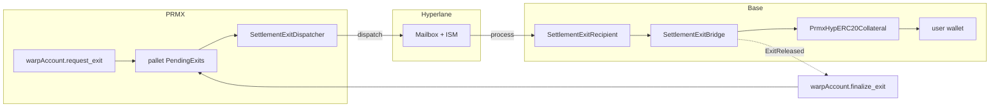

# M73 — Canonical Outbound Exit Design

> **TL;DR**: PRMX outbound exits use a **dispatcher + recipient + bridge** split. User balances stay in `pallet-assets(1)`; the Hyperlane dispatcher cannot emit a message unless pallet state authorizes it; Base release is allowance-backed and idempotent.

## Route



The runtime `EvmDispatchHook` is intentionally a **no-op**. Pallet exits never emit Frontier-invisible Hyperlane dispatches. Transport authority is `PendingExits` state, surfaced through the `0x0801` read-only precompile and validated inside the dispatcher.

## Design rules

| Rule | Why |
|---|---|
| User balances stay in `pallet-assets(1)` | No dual ledger on PRMX; PRMX EVM synthetic balances are not authoritative |
| All Hyperlane sends are EVM transactions | Relayer indexes them via Frontier RPC; runtime-internal dispatches would poison sequence indexing |
| Dispatcher rejects payloads that don't match `PendingExits[exitId]` | Keeper EOA has no transport authority |
| Outbound release lives in `SettlementExitBridge`, not the collateral subclass | Hyperlane-derived custody contract stays small |

## Contracts at a glance

| Side | Contract | Role |
|---|---|---|
| PRMX EVM | `SettlementExitDispatcher` | Validates pending exit, formats `ExitMessageV1`, pays Hyperlane gas, calls `Mailbox.dispatch` |
| Base EVM | `SettlementExitRecipient` | ISM-aware Hyperlane handler; verifies origin/sender/version, computes commitment, forwards to bridge |
| Base EVM | `SettlementExitBridge` | PRMX-owned executor + replay guard; pulls USDC from collateral, emits `ExitReleased` |
| Base EVM | `PrmxHypERC20Collateral` | Custody contract; grants allowance to bridge via `approveTokenForBridge` |

## PRMX — `SettlementExitDispatcher`

Validates against `PendingExits[exitId]` via the `0x0801` precompile, formats `ExitMessageV1`, pays Hyperlane gas from its prefunded native balance, calls `Mailbox.dispatch(...)`, emits `ExitDispatched(...)`.

Submission policy:

| `authorizedCaller` | Mode |
|---|---|
| `address(0)` | Permissionless / keeper-driven (intended deployment mode) |
| `!= address(0)` | Emergency throttle: restricts submission to one address |

External surface:

```solidity
function dispatchExit(
    uint32 routeId,
    uint64 exitId,
    address recipient,
    uint256 amount
) external returns (bytes32 messageId);

event ExitDispatched(
    uint64 indexed exitId,
    bytes32 indexed messageId,
    address indexed recipient,
    uint256 amount,
    uint32 routeId
);
```

If the dispatcher's native balance is insufficient, `dispatchExit(...)` reverts and the pallet exit stays pending and retryable.

## Base — `SettlementExitRecipient`

Implements `IMessageRecipient`. Verifies `msg.sender == Base Mailbox`, `origin == PRMX_DOMAIN`, `sender == trustedSender`, payload `version`, and payload `routeId == expectedRouteId`. Computes the replay/audit commitment and forwards to `SettlementExitBridge.releaseExit(...)`.

ISM-aware: the Base Mailbox does not fall back to the default DomainRouting ISM for PRMX-origin messages.

```solidity
function handle(uint32 origin, bytes32 sender, bytes calldata message) external payable;
function setTrustedSender(bytes32 next) external;
function setExitBridge(address next) external;

event ExitMessageHandled(
    uint64 indexed exitId,
    bytes32 indexed commitment,
    address indexed recipient,
    uint256 amount,
    bool released
);
```

## Base — `SettlementExitBridge`

PRMX-owned executor + replay guard. **Not** a reserve holder.

- Stores `processedExitCommitments[exitId]`.
- Pulls USDC from the active collateral via `transferFrom`.
- Emits the canonical `ExitReleased` event that PRMX watchers finalize against.

```solidity
function releaseExit(
    uint64 exitId,
    bytes32 commitment,
    address recipient,
    uint256 amount
) external returns (bool released);

function setRecipientContract(address next) external;

event ExitReleased(
    uint64 indexed exitId,
    address indexed recipient,
    uint256 amount,
    bytes32 commitment
);
```

Release semantics (caller must be `recipientContract`):

| `processedExitCommitments[exitId]` | Action |
|---|---|
| `0` (unseen) | Store `commitment`, `transferFrom(collateral, recipient, amount)`, emit `ExitReleased`, return `true` |
| `== commitment` | Idempotent duplicate; no transfer; return `false` |
| `!= commitment` | Revert with `CommitmentMismatch` |

One-time owner wiring (Council motions):

- `PrmxHypERC20Collateral.approveTokenForBridge(USDC, SettlementExitBridge)`
- `SettlementExitRecipient.setExitBridge(SettlementExitBridge)`
- `SettlementExitBridge.setRecipientContract(SettlementExitRecipient)`

## Base — `PrmxHypERC20Collateral`

Custody contract. Holds the active reserve USDC, enforces source-side deposit gating, and grants allowance to `SettlementExitBridge` via the inherited `approveTokenForBridge(...)` surface. Outbound release logic lives in the bridge, not here.

## Payload schema

`ExitMessageV1`:

```solidity
abi.encode(
    uint8(1),          // version
    uint32 routeId,
    uint64 exitId,
    address recipient,
    uint256 amount     // 6-decimal USDC amount
)
```

Commitment:

```solidity
bytes32 commitment = keccak256(
    abi.encode(
        uint8(1),
        origin,
        sender,
        routeId,
        exitId,
        recipient,
        amount
    )
);
```

`IMessageRecipient.handle(...)` does not receive Hyperlane `messageId`, so `origin + sender + decoded payload` is the replay/audit fingerprint.

## Why the runtime hook is a no-op

`HyperlaneExitDispatchHook` returns `Ok(())` and never calls `pallet_evm::Runner::call(...)`.

Runtime-internal `Runner::call` emits `pallet_evm::Log` events visible in `system.events` but **not** in Frontier `eth_getLogs`. Hyperlane relayers index PRMX as an Ethereum chain via RPC logs, so a hidden dispatch would advance mailbox / merkle counters without giving the relayer the logs it needs — poisoning contiguous sequence indexing.

The visible PRMX EVM transaction to `SettlementExitDispatcher` is therefore the canonical transport submission point. Any keeper / user / relayer helper may submit it; pallet state remains the authority.

## End-to-end sequence

| # | Step | What happens |
|---|---|---|
| 1 | Request | User submits `warpAccount.request_exit`. Pallet escrows balance, inserts `PendingExits[exitId]`, emits `ExitRequested` |
| 2 | Eligible | No-op `EvmDispatchHook` runs; exit waits for a visible PRMX dispatcher tx |
| 3 | Dispatch | Keeper calls `SettlementExitDispatcher.dispatchExit(...)`. Dispatcher reads `0x0801.pendingExit(exitId)`, rejects mismatches, pays Hyperlane gas, calls `Mailbox.dispatch`, emits `ExitDispatched` |
| 4 | Deliver | Validators sign; relayer calls Base `Mailbox.process(...)`; `SettlementExitRecipient.handle` computes commitment; `SettlementExitBridge.releaseExit` `transferFrom`s USDC; emits `ExitReleased` |
| 5 | Finalize | Watcher observes `ExitReleased`, calls `warpAccount.finalize_exit(exitId, evm_tx_hash)`. Pallet removes `PendingExits`, burns escrowed assets, decrements `BridgeMintedTotal`, inserts replay guards |

If the active reserve is short on Base, `transferFrom` reverts, `handle(...)` reverts, and the message stays undelivered until the reserve refills and the relayer retries.

## Oracle-service watcher

- `getExitReleaseState()` reads `SettlementExitBridge.processedExitCommitments(exitId)` and scans `ExitReleased` events.
- Oracle-service may act as a `dispatchExit` keeper. It treats `authorizedCaller() == address(0)` as expected and skips the operator-equality check.
- Event/log scanning is idempotent; already-dispatched exits are not retried.

## Security properties

| Property | Guard |
|---|---|
| No dual ledger on PRMX | `pallet-assets(1)` is the only authoritative balance store |
| No EOA transport authority | Dispatcher rejects unless `PendingExits[exitId]` matches |
| Atomic failure on underfunded dispatch | Dispatcher reverts; pallet exit stays retryable |
| Atomic failure on short Base reserve | Delivery stays pending until reserve refills |
| Idempotent Base release | Duplicate same-commitment deliveries return `false` (no double-release) |
| Replay guard on PRMX finalize | `evm_tx_hash` cannot be reused across `finalize_exit` |
| Custody contract stays small | Release logic lives in `SettlementExitBridge`, not the Hyperlane-derived collateral subclass |

## Non-goals

- No attempt to make Base release succeed when the reserve is short.
- No attempt to burn PRMX supply before Base release is confirmed.
- No support for direct `HypERC20Synthetic.transferRemote()` as a permanent exit path.
