# M75 — ICA Command Bus and Yield Accrual Flow

> **Scope**: ICA (Hyperlane Interchain Accounts) is PRMX's operational control bus to Base — **not** the deposit / exit settlement transport. Settlement uses the pallet-first canonical Hyperlane route in [m72](/docs/hyperlane-migration/m72-pallet-assets-hyperlane-canonical-path-decision) and [m73](/docs/hyperlane-migration/m73-exit-dispatcher-design).

## What ICA covers

| Domain | Calls dispatched via ICA |
|---|---|
| Policy lifecycle | `VaultFactory.deployVault`, `PolicyVaultManager.rebalance`, `PolicyVaultManager.returnSettlementCapital`, `PolicyVaultManager.topUpReserve` |
| Testnet mock-yield accrual | `MockLendingVault.accrueYield` |

## Route

```mermaid
flowchart LR
  OP[PRMX operator] --> PR[PRMX EVM<br/>InterchainAccountRouter]
  PR --> HL[Hyperlane<br/>Mailbox / ISM / relayer / validators]
  HL --> BR[Base<br/>InterchainAccountRouter]
  BR --> PROXY[Deterministic<br/>Base ICA proxy]
  PROXY --> IR[IcaReceiver.execute&#40;bytes&#41;]
  IR --> ICR[IcaCommandRouter.execute&#40;target, calldata&#41;]
  ICR --> TGT[Allowlisted Base target]
```



The Base target sees `msg.sender == IcaCommandRouter`. Required Base operator wiring:

| Setter | New value |
|---|---|
| `IcaReceiver.setTarget` | `IcaCommandRouter` |
| `PolicyVaultManager.setOperator` | `IcaCommandRouter` |
| `VaultFactory.setOperator` | `IcaCommandRouter` |

After this wiring, direct Base writes to `PolicyVaultManager` / `VaultFactory` are expected to fail by design. New operation code must use ICA dispatch or PRMX-native / pallet operations that later produce relayer-visible Hyperlane messages.

## Components

| Layer | Component | Role |
|---|---|---|
| PRMX EVM | `InterchainAccountRouter` (Hyperlane standard) | Bundled in PRMX EVM deployment script |
| Base | `IcaReceiver` | Project-owned deterministic-proxy + gas-floor gate; safe to redeploy when the expected `(origin, owner, router, ism)` tuple changes |
| Base | `IcaCommandRouter` | Project-owned allowlist layer behind `IcaReceiver` |
| Base | `MockLendingVault` | Emits `YieldAccrued` when testnet yield is physically minted |
| oracle-service | `capital/ica-dispatch.ts` | Builds PRMX-router ICA calls with 2M gas metadata; quotes native IGP fee via `Mailbox.quoteDispatch(...)` when `ICA_DISPATCH_NATIVE_FEE_WEI=0` |
| oracle-service | `capital/policy-vault-creation-worker.ts` | ICA-aware: dispatches `VaultFactory.deployVault(...)` and `PolicyVaultManager.rebalance(...)` from PRMX, polls Base for the resulting vault / funding effect |
| oracle-service | `capital/settlement-dispatch-worker.ts` | ICA-aware: dispatches `PolicyVaultManager.returnSettlementCapital(...)` from PRMX, waits for Base `SettlementCapitalReturned` before finalizing PRMX with the Base tx hash |
| oracle-service | `rebalancer/executor/` | ICA-aware: submits autonomous `PolicyVaultManager.rebalance(...)` decisions as PRMX-side ICA dispatches |
| oracle-service | `capital/yield-accrual-driver.ts` | Scans PolicyVault strategy assets, dispatches `MockLendingVault.accrueYield(strategy, amount)` via ICA |
| Pallet | `policyVaultReporter.reportVaultAssets` | Wired into `prmxPolicyV4.applyVaultAssetsReport`; `CapitalApiV4Adapter` credits / debits `pallet-assets(1)` plus `warpAccount.bridgeMintedTotal` for yield / loss deltas |

ICA is independent of yield-report transport. The yield accrual driver causes Base-side movement; [m76](/docs/hyperlane-migration/m76-yield-report-hyperlane-transport) covers how Base-side vault totals and rebalance acknowledgements flow back to PRMX through Hyperlane.

## Initial Allowlist

Council allowlists only the selectors needed for current goals:

| Target | Selector |
|---|---|
| `VaultFactory` | `deployVault(bytes32)` |
| `PolicyVaultManager` | `rebalance(bytes32[],int256[])` |
| `PolicyVaultManager` | `topUpReserve(int256)` |
| `PolicyVaultManager` | `returnSettlementCapital(bytes32,uint256)` |
| `MockLendingVault` | `accrueYield(address,uint256)` |

Admin setters remain Council motions unless explicitly delegated.

## Deployment / Wire-up

**Zero-start activation order:**

1. Deploy PRMX EVM core, including `core.icaRouter`.
2. Enroll PRMX ↔ Base ICA routers symmetrically with router + ISM.
3. Derive the Base local ICA proxy for `(origin=PRMX_DOMAIN, owner=PRMX router caller, router=PRMX_ICA_ROUTER, ism=Base ISM)`.
4. Deploy Base stack with `EXPECTED_ICA_PROXY = derived proxy`.
5. Council wires `IcaReceiver.target = IcaCommandRouter`.
6. Council allowlists the initial selectors on `IcaCommandRouter`.
7. Council rotates `PolicyVaultManager.operator` and `VaultFactory.operator` to `IcaCommandRouter`.
8. Enable oracle-service ICA / yield env **only after** 1–7 are complete.

**Incremental redeploy** (existing generation, no full Hyperlane redeploy):

```bash
scripts/hyperlane/deploy-prmx-ica-router.sh
scripts/hyperlane/deploy-base-ica-command-bus.sh
node scripts/hyperlane/sync-zero-start-configs.mjs \
  --base-manifest evm/deployments/base-sepolia/hyperlane-manifest.json \
  --prmx-manifest evm/deployments/prmx-evm/hyperlane-manifest.json \
  --smoke-manifests scripts/hyperlane-smoke/manifest.do.json \
  --canonical-inbound
GAS_PRICE_WEI=1000000000 scripts/hyperlane/execute-ica-precutover-wireup.sh
```

`execute-ica-precutover-wireup.sh` intentionally stops **before** the two Base operator rotations; those motions stay manual so cutover remains a deliberate gate.

> **Why dispatch from an EOA, not a pallet?** `ica-dispatch.ts` submits from the operator key on PRMX EVM. A pallet calling the Mailbox via `pallet_evm::Runner::call(...)` is avoided on purpose: runtime-internal EVM calls emit `pallet_evm::Log` events that show up in `system.events` but **not** in Frontier `eth_getLogs`, so Hyperlane relayers cannot index them. The relayer-visible PRMX EVM transaction is the safe scaffold until a chain-governed dispatch surface is available.

## Wire-up Verification Harness

Before enabling any ICA / yield env flag, run:

```bash
node scripts/hyperlane/ica-wireup-check.mjs \
  --manifest scripts/hyperlane-smoke/manifest.do.json \
  --base-rpc https://sepolia.base.org \
  --prmx-rpc http://<prmx-host>:9944 \
  --phase cutover \
  --strict
```

If the PRMX owner EOA is not encoded in the deployed `IcaReceiver.prmxOwner()`, pass it explicitly:

```bash
node scripts/hyperlane/ica-wireup-check.mjs \
  --manifest scripts/hyperlane-smoke/manifest.do.json \
  --prmx-owner 0x... \
  --phase cutover \
  --strict
```

| `--phase` | When to use |
|---|---|
| `deploy` | Immediately after deployment |
| `wireup` | After router enrollment, target, and allowlist motions; operator checks report as `INFO` so workers using the direct operator path are not broken |
| `cutover` | Full operator rotation expected to be complete |

The script never sends transactions. It checks router enrollment in both directions, ICA proxy derivation, `IcaReceiver.target`, `IcaCommandRouter.icaReceiver`, `PolicyVaultManager.operator`, `VaultFactory.operator`, and initial command allowlist entries.

| Outcome | Meaning |
|---|---|
| `PASS` | Wired correctly |
| `TODO` | Wire-up still missing — exits non-zero with `--strict` |
| `FAIL` | Unexpected state or stale address — exits non-zero with `--strict` |
| `INFO` | Advisory for the selected phase |
| `SKIP` | Optional surface or required manifest field absent |

The script also prints candidate calldata for owner / Safe actions:

- `InterchainAccountRouter.enrollRemoteRouterAndIsm(...)` on PRMX and Base
- `IcaReceiver.setTarget(IcaCommandRouter)`
- `IcaCommandRouter.setCommandPermissions(...)`
- `PolicyVaultManager.setOperator(IcaCommandRouter)`
- `VaultFactory.setOperator(IcaCommandRouter)`

## Yield Accrual Operator Surface

To make the 24h driver testable without waiting a full day, oracle-service exposes:

| Endpoint | Behavior |
|---|---|
| `GET /capital/yield-accrual/status` | Reports enabled / running flags, in-flight cycle, config pins (`intervalMs`, `routeId`, `annualYieldBps`, min/max accrual, max policies), `nextCycleAtMs`, last cycle timestamps + elapsed window, last cycle summary (`scanned`, `eligible`, `dispatched`, `totalAccrued`, optional `skipped`), last error |
| `POST /capital/operator/run-yield-accrual` | Executes one cycle immediately; returns the same summary (`totalAccrued` serialized as string). On a fresh process the first manual run uses the configured interval as the effective elapsed window — with the default `YIELD_ACCRUAL_INTERVAL_MS=86400000` it acts as a manual 24h-equivalent validation run |

The operator endpoint does **not** authorize leaving `YIELD_ACCRUAL_DRIVER_ENABLED=true` permanently. Intended cadence:

1. Keep the autonomous driver disabled.
2. Use `POST /capital/operator/run-yield-accrual` for an explicit cadence probe.
3. Follow with a report cycle and invariant readback.
4. Only then decide whether to run a recurring soak.

## Env Surface

**ICA dispatch:**

```dotenv
ICA_DISPATCH_ENABLED=true
PRMX_ICA_ROUTER_ADDRESS=0x...
PRMX_ICA_MAILBOX_ADDRESS=0x...
BASE_ICA_RECEIVER_ADDRESS=0x...
BASE_ICA_COMMAND_ROUTER_ADDRESS=0x...
BASE_ICA_ROUTER_ADDRESS=0x...
BASE_ICA_ISM_ADDRESS=0x...
PRMX_ICA_DISPATCH_HOOK_ADDRESS=0x...
ICA_BASE_DOMAIN=84532
ICA_DISPATCH_GAS_LIMIT=2000000
ICA_DISPATCH_FEE_BPS=12000
ICA_DISPATCH_PRMX_TX_GAS=2500000
```

**Yield accrual:**

```dotenv
YIELD_ACCRUAL_DRIVER_ENABLED=true
YIELD_ACCRUAL_ROUTE_ID=2
YIELD_ACCRUAL_INTERVAL_MS=86400000
YIELD_ACCRUAL_ANNUAL_BPS=500
```

**Autonomous rebalancing:**

```dotenv
REBALANCER_EXECUTOR_ENABLED=true
REBALANCER_DECISION_ENABLED=true
REBALANCER_MONITOR_ENABLED=true
```

| Behavior | Note |
|---|---|
| Executor uses ICA when available | Active whenever `ICA_DISPATCH_ENABLED=true` and the full ICA config is present |
| Fail-closed when ICA is incomplete | If ICA is explicitly enabled but partially configured, the executor stays dormant instead of silently falling back to direct Base writes |
| `ICA_DISPATCH_PRMX_TX_GAS=2500000` (default) | Caps PRMX EVM dispatch tx gas. `eth_estimateGas` can over-estimate ICA router calls above the block gas limit; this explicit cap prevents that |
