# M76 — Yield Report Hyperlane Transport

> **Scope**: Vault yield / loss reports from Base PolicyVaults flow back to PRMX through Hyperlane and land in canonical `pallet-assets(1)` bookkeeping. Independent from the ICA command bus ([m75](/docs/hyperlane-migration/m75-ica-yield-command-bus)) — ICA causes the Base-side movement; this transport reports the result back.

## Route

```mermaid
flowchart LR
  subgraph Oracle
    OS[oracle-service<br/>VaultReporter]
  end
  subgraph Base
    YR[YieldReporter]
    BMB[Mailbox]
  end
  subgraph HL[Hyperlane]
    REL[ISM / relayer / validators]
  end
  subgraph PRMX
    PMB[Mailbox]
    YRR[YieldReportRecipient]
    P802[0x0802 precompile]
    PVR[pallet-prmx-policy-vault-reporter]
    PV4[pallet-policy-v4]
    PA[pallet-assets&#40;1&#41;]
  end
  OS --> YR --> BMB --> REL --> PMB --> YRR --> P802 --> PVR --> PV4 --> PA
```



The `YieldReportRecipient` enforces Mailbox-origin, trusted-sender, envelope-version, kind, and fixed-length checks before invoking the precompile. The precompile is the runtime boundary and accepts only allowlisted EVM callers (the `YieldReportRecipient` address).

**Pre-settlement refresh:** in `hyperlane` mode, the single-policy refresh waits for `policyVaultReporter.policyVaultAssets(policyId).reported_at > pending_since_block`. If delivery doesn't land before timeout, it **fails closed** and leaves the pending settlement entry on-chain for retry.

## Contracts and Runtime Surface

| Side | Surface | Role |
|---|---|---|
| Base | `evm/src/hyperlane/YieldReporter.sol` | Dispatches fixed-schema envelopes via `IMailbox.dispatch`; quotes fees through `quoteYieldBatch`, `quoteYieldSingle`, `quoteRebalanceAck`; operator-gated |
| PRMX EVM | `evm/src/hyperlane/YieldReportRecipient.sol` | Handles Mailbox-delivered messages from trusted Base sender; calls `IYieldReportPrecompile.handleYieldReport(bytes)` at `0x0802` with bounded gas stipend; exposes `interchainSecurityModule()` for ISM lookup |
| Runtime | `pallets/pallet-evm-precompile-prmx-yield-report` | Address `0x0000000000000000000000000000000000000802`; selector `handleYieldReport(bytes) = 0x281684ec`; `PrmxYieldReportAuthorizedCallers` is empty in source — each deployment must pin it to the live `YieldReportRecipient` before `hyperlane` mode can mutate state |

## Envelope Schema

All integers are big-endian and the first byte is `version = 1`.

| Kind | Byte 1 | Length | Body |
| --- | ---: | ---: | --- |
| Batch | `1` | `20 + n * 32` | `epoch u64`, `batchIndex u32`, `batchCount u32`, `entriesLen u16`, then `policyId bytes16 + totalAssets u128` repeated |
| Single | `2` | `42` | `policyId bytes16`, `totalAssets u128`, `reportedAt u64` |
| Rebalance ack | `3` | `82` | `policyId bytes16`, `credit u128`, `debit u128`, `sourceMessageId bytes32` |

- Batch replay is idempotent by `(epoch, batchIndex)`.
- Single replay is idempotent by `(policyId, reportedAt)`.
- Rebalance acknowledgements use `messageId` idempotency.

## Gas Controls

Both caps are required:

| Cap | Value | Bounds |
|---|---|---|
| `YieldReportRecipient.PRECOMPILE_GAS_STIPEND` | `8_000_000` | recipient → `0x0802` precompile call |
| Relayer `chains.prmx.transactionOverrides.gasLimit` | `15_000_000` | Frontier `Mailbox.process(...)` estimation, prevents chasing the destination block limit |

Use `scripts/hyperlane/profile-yield-report-gas.mjs` to isolate direct precompile, recipient handle, and full Mailbox process costs before changing either cap.

The recipient must call the precompile with low-level `address(precompile).call{gas: PRECOMPILE_GAS_STIPEND}(...)`. High-level Solidity interface calls revert because Frontier precompile addresses have no EVM bytecode, and unbounded low-level calls can make `eth_estimateGas` chase the destination block gas limit.

## Accounting Guards

- `record_vault_funded` calibrates `initialVaultAssets` immediately, so the first post-funding report is real yield / loss rather than an implicit baseline reset.
- The `prmxPolicyV4.update_vault_assets` direct extrinsic is restricted to no-op / downward reports. Upward vault growth must arrive through the trusted `pallet-prmx-policy-vault-reporter` path (Hyperlane `0x0802`).
- Vault-backed settlement fails closed if `latestVaultAssets` is missing. The watcher returns the full latest vault snapshot from Base to Reserve before PRMX finalization.
- `oracle-service` excludes `fundsStatus=Settled` policies from the report submission path while still keeping their vault balances inside the cached EVM total used by invariants / reconciliation. Settled vault balances can legitimately be `0` or tiny dust and must not go through the yield / loss path.

## Oracle-Service Transport Flag

Live env shape:

```text
VAULT_REPORTER_ENABLED=true
VAULT_REPORTER_PERIODIC_ENABLED=true
VAULT_REPORTER_PERIODIC_DISPATCH_ENABLED=true
VAULT_REPORTER_TRANSPORT=hyperlane
VAULT_REPORTER_PRE_SETTLEMENT_TRANSPORT=hyperlane
VAULT_REPORTER_YIELD_REPORTER_ADDRESS=0x...
VAULT_REPORTER_HYPERLANE_FEE_WEI=0
VAULT_REPORTER_HYPERLANE_DELIVERY_TIMEOUT_MS=900000
VAULT_REPORTER_HYPERLANE_DELIVERY_POLL_MS=5000
VAULT_REPORTER_HYPERLANE_BATCH_SIZE=1
```

| `VAULT_REPORTER_TRANSPORT` | When |
|---|---|
| `hyperlane` | Live posture |
| `both` | Rollback / next-generation soak after recipient or runtime-allowlist redeploy — mirrors through Hyperlane and reporter-pallet direct paths |
| `direct` | Safe mode while the Hyperlane path is being redeployed |

| Setting | Behavior |
|---|---|
| `VAULT_REPORTER_HYPERLANE_FEE_WEI=0` | Reporter reads the matching `YieldReporter.quote*` and sends the quoted native fee |
| `VAULT_REPORTER_HYPERLANE_FEE_WEI` non-zero | Overrides the quote for emergency / operator testing |
| `..._DELIVERY_TIMEOUT_MS` / `..._POLL_MS` | Apply to targeted pre-settlement `dispatchYieldSingle(...)` refreshes only |
| `VAULT_REPORTER_INTERVAL_MS` | Drives the 24h active-vault batch scheduler |
| `VAULT_REPORTER_HYPERLANE_BATCH_SIZE=1` | Required at the current PRMX process-gas cap |

## Deployment and Wire-Up

| Script | Purpose |
|---|---|
| Base `DeployHyperlane.s.sol` | Deploys `YieldReporter` |
| PRMX `DeployPrmxEvmHyperlane.s.sol` / `scripts/hyperlane/deploy-prmx-evm.sh` | Deploys `YieldReportRecipient`, records precompile `0x0802` |
| `scripts/hyperlane/deploy-yield-report-base.sh` | Incremental Base redeploy on a live generation |
| `scripts/hyperlane/deploy-yield-report-prmx-evm.sh` | Incremental PRMX redeploy on a live generation |
| `scripts/hyperlane/execute-zero-start-wireup.sh` | Sets `YieldReporter.remoteRecipient` ↔ `YieldReportRecipient.trustedSender` |
| `scripts/hyperlane/sync-zero-start-configs.mjs` | Exports `VAULT_REPORTER_YIELD_REPORTER_ADDRESS` and smoke manifest fields |

After `YieldReportRecipient` is known, prepare the allowlist runtime, then submit the upgrade via the Council runtime-upgrade runbook before changing `VAULT_REPORTER_TRANSPORT`:

```bash
node scripts/hyperlane/apply-yield-report-runtime-allowlist.mjs \
  --recipient "$(jq -r '.prmx.yieldReportRecipient' evm/deployments/prmx-evm/hyperlane-manifest.json)"
```

**Activation order** for a new generation or replacement recipient:

1. Deploy Base `YieldReporter` and PRMX `YieldReportRecipient` incrementally.
2. Run `execute-zero-start-wireup.sh` so both trusted-sender pointers match.
3. Patch / build / upgrade the runtime allowlist for precompile `0x0802`.
4. Sync configs / manifests, set `VAULT_REPORTER_TRANSPORT=both`, restart the oracle, soak until Hyperlane snapshots match the reporter-pallet direct path. Keep `VAULT_REPORTER_PERIODIC_DISPATCH_ENABLED=true` once the recipient stipend and PRMX relayer process-gas cap are in place.
5. Run the targeted `yield-pre-settlement-refresh` smoke to prove a single pre-settlement refresh waits for Hyperlane delivery and PRMX freshness.
6. Run `settlement-pre-refresh` to prove a real `pendingPreSettlementReport` queue can be cleared through Hyperlane refresh and settlement can finalize.
7. Only after `both` mode is clean, return `VAULT_REPORTER_TRANSPORT=hyperlane`.

**Configuration constraints:**

- Base `YieldReporter` must share the active MerkleTreeHook with `HypERC20Collateral`; otherwise validator checkpoints may not reach quorum even after a successful `Mailbox.dispatch`.
- In `both` mode, `oracle-service` treats the reporter-pallet direct path as the safety gate: failed direct batches are bisected, failing entries are quarantined for one hour, and only direct-accepted entries are mirrored through Hyperlane.

## Redeploy / Rollback Gates

After a runtime, `YieldReportRecipient`, `0x0802` allowlist, or relayer gas-cap redeploy, do **not** return to `VAULT_REPORTER_TRANSPORT=hyperlane` until **every** gate is green:

| Gate | Required state |
|---|---|
| Runtime allowlist | `PrmxYieldReportAuthorizedCallers` contains the live PRMX `YieldReportRecipient` |
| Base ↔ PRMX pointers | `YieldReporter.remoteRecipient` ⟷ `YieldReportRecipient.trustedSender` match |
| Mock-flow test | Passes for batch, single, and rebalance ack |
| Pre-settlement single-refresh | Polling enabled, fail-closed, passing live |
| `both` mode soak | Hyperlane-delivered snapshots match the reporter-pallet direct path |
| Settlement smoke | Real `pendingPreSettlementReport` queue cleared through Hyperlane refresh |
| Relayer queue audit | `scripts/hyperlane/relayer-queue-audit.mjs` classifies as `empty` or `historical_backlog` (not `active_or_unclassified`); `relayer-queue-cleanup-plan.mjs` finds no current-epoch / current-recipient retry items |

`pallet-prmx-policy-vault-reporter` lets a newer epoch supersede an older incomplete one instead of wedging on `YieldEpochIncomplete`, so a never-finished split epoch can't permanently stall newer single-batch epochs.

## Combined Backend Gate

`run-smoke --only=api-lifecycle-hyperlane` walks **health → deposit → active policy → rebalance → `settlement-pre-refresh` → exit → health**, exercising the Hyperlane report path inside a broader API-first lifecycle.

Pre/post relayer queue audits are part of the gate: historical backlog is tolerated, but the run fails if the queue becomes `active_or_unclassified`, grows in count, or advances to newer stale nonces during the lifecycle.

## Active-Vault Monitor

`scripts/prmx-monitor/new-policy-monitor.mjs` checks Base `bridgedIn - returnedOut` against `maxPayout`, treats missing / stale report evidence as a delivery anomaly only when periodic dispatch is enabled, and distinguishes active Escrowed policies from settled dust.
